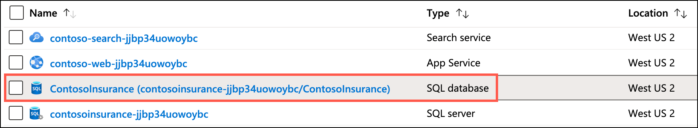
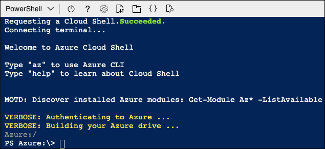
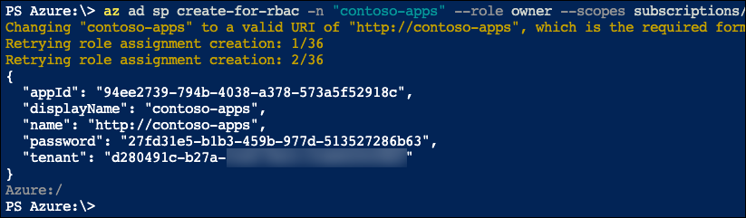

# App modernization hands-on lab step-by-step

## Abstract and learning objectives

In this hands-on lab, you implement the steps to modernize a legacy on-premises application, including upgrading and migrating the database to Azure and updating the application to take advantage of serverless and cloud services.

At the end of this hands-on lab, your ability to build solutions for modernizing legacy on-premises applications and infrastructure using cloud services will be improved.

## Overview

Contoso, Ltd. (Contoso) is a new company in an old business. Founded in Auckland, NZ, in 2011, they provide a full range of long-term insurance services to help individuals who are under-insured, filling a void their founders saw in the market. From the beginning, they grew faster than anticipated and have struggled to cope with rapid growth. During their first year alone, they added over 100 new employees to keep up with the demand for their services. To manage policies and associated documentation, they use a custom-developed Windows Forms application, called PolicyConnect. PolicyConnect uses an on-premises SQL Server 2008 R2 database as its data store, along with a file server on its local area network for storing policy documents. That application and its underlying processes for managing policies have become increasingly overloaded.

Contoso recently started a new web and mobile projects to allow policyholders, brokers, and employees to access policy information without requiring a VPN connection into the Contoso network. The web project is a new .NET Core 2.2 MVC web application, which accesses the PolicyConnect database using REST APIs. They eventually intend to share the REST APIs across all their applications, including the mobile app and WinForms version of PolicyConnect. They have a prototype of the web application running on-premises and are interested in taking their modernization efforts a step further by hosting the app in the cloud. However, they don't know how to take advantage of all the managed services of the cloud since they have no experience with it. They would like some direction converting what they have created so far into a more cloud-native application.

They have not started the development of a mobile app yet. Contoso is looking for guidance on how to take a .NET developer-friendly approach to implement the PolicyConnect mobile app on Android and iOS.

To prepare for hosting their applications in the cloud, they would like to migrate their SQL Server database to a PaaS SQL service in Azure. Contoso is hoping to take advantage of the advanced security features available in a fully-managed SQL service in the Azure. By migrating to the cloud, they hope to improve their technological capabilities and take advantage of enhancements and services that are enabled by moving to the cloud. The new features they would like to add are automated document forwarding from brokers, secure access for brokers, access to policy information, and reliable policy retrieval for a dispersed workforce. They have been clear that they will continue using the PolicyConnect WinForms application on-premises, but want to update the application to use cloud-based APIs and services. Additionally, they want to store policy documents in cloud storage for retrieval via the web and mobile apps.

## Solution architecture

Below is a high-level architecture diagram of the solution you implement in this hands-on lab. Please review this carefully, so you understand the whole of the solution as you are working on the various components.


The solution begins with migrating Contoso's SQL Server 2008 R2 database to Azure SQL Database using the Azure Database Migration Service (DMS). Using the Data Migration Assistant (DMA) assessment, Contoso determined that they can migrate into a fully-managed SQL database service in Azure. The assessment revealed no compatibility issues or unsupported features that would prevent them from using Azure SQL Database. Next, they deploy the web and API apps into Azure App Services. Also, mobile apps, built for Android and iOS using Xamarin, are created to provide remote access to PolicyConnect. The website, hosted in a Web App, provides the user interface for browser-based clients, whereas the Xamarin Forms-based app provides the UI for mobile devices. Both the mobile app and website rely on web services hosted in a Function App, which sits behind API Management. An API App is also deployed to host APIs for the legacy Windows Forms desktop application. Light-weight, serverless APIs are provided by Azure Functions and Azure Functions Proxies to provide access to the database and policy documents stored in Blob Storage.

Azure API Management is used to create an API Store for development teams and affiliated partners. Sensitive configuration data, like connection strings, are stored in Key Vault and accessed from the APIs or Web App on demand so that these settings never live in their file system. The API App implements the cache aside pattern using Azure Redis Cache. A full-text cognitive search pipeline is used to index policy documents in Blob Storage. Cognitive Services are used to enable search index enrichment using cognitive skills in Azure Search. PowerApps is used to enable authorized business users to build mobile and web create, read, update, delete (CRUD) applications. These apps interact with SQL Database and Azure Storage. Microsoft Flow enables them to orchestrations between services such as Office 365 email and services for sending mobile notifications. These orchestrations can be used independently of PowerApps or invoked by PowerApps to provide additional logic. The solution uses user and application identities maintained in Azure AD.

> **Note:** The solution provided is only one of many possible, viable approaches.

## Requirements

- Microsoft Azure subscription must be pay-as-you-go or MSDN.
  - Trial subscriptions will not work.
- A virtual machine configured with Visual Studio Community 2019 or higher (setup in the Before the hands-on lab exercises)
- **IMPORTANT**: To complete this lab, you must have sufficient rights within your Azure AD tenant to:
  - Create an Azure Active Directory application and service principal
  - Assign roles on your subscription
  - Register resource providers

## Exercise 3: Configure Key Vault

Duration: 15 minutes

As part of their efforts to put tighter security controls in place, Contoso has requested that application secrets to be stored in a secure manner, so they aren't visible in plain text in application configuration files. In this exercise, you configure Azure Key Vault, which securely stores application secrets for the Contoso web and API applications, once migrated to Azure.

### Task 1: Add Key Vault access policy

In this task, you add an access policy to Key Vault to allow secrets to be created with your account.

1. In the [Azure portal](https://portal.azure.com), navigate to your **Key Vault** resource by selecting **Resource groups** from Azure services list, selecting the **hands-on-lab-SUFFIX** resource group, and then selecting the **contoso-kv-UniqueId** Key vault resource from the list of resources.

   

2. On the Key Vault blade, select **Access policies** under Settings in the left-hand menu, and then select **+ Add Access Policy**.

    

3. In the Add access policy dialog, enter the following:

   - **Configure from template (optional)**: Leave blank.
   - **Key permissions**: Leave set to 0 selected.
   - **Secret permissions**: Select this, and then choose **Select All**, to give yourself full rights to manage secrets.
   - **Certificate permissions**: Leave set to 0 selected.
   - **Select principal**: Enter the email address of the account you are logged into the Azure portal with, select the user object that appears, and then choose **Select**.
   - **Authorized application**: Leave set to None selected.

   

4. Select **Add**.

5. Select **Save** on the Access policies toolbar.

   

### Task 2: Create a new secret to store the SQL connection string

In this task, you add a secret to Key Vault containing the connection string for the `ContosoInsurance` Azure SQL database.

1. First, you need to retrieve the connection string to your Azure SQL Database. In the [Azure portal](https://portal.azure.com), navigate to your **SQL database** resource by selecting **Resource groups** from Azure services list, selecting the **hands-on-lab-SUFFIX** resource group, and then selecting the **ContosoInsurance** SQL database resource from the list of resources.

   

2. On the SQL database blade, select **Connection strings** from the left-hand menu, and then copy the ADO.NET connection string.

   

3. Paste the copied connection string into a text editor, such as Notepad.exe. This is necessary because you need to replace the tokenized password value before adding the connection string as a Secret in Key Vault.

4. In the text editor, find and replace the tokenized `{your_password}` value with `Password.1!!`.

5. Your connection string should now resemble the following:

    ```csharp
    Server=tcp:contosoinsurance-jt7yc3zphxfda.database.windows.net,1433;Initial Catalog=ContosoInsurance;Persist Security Info=False;User ID=demouser;Password=Password.1!!;MultipleActiveResultSets=False;Encrypt=True;TrustServerCertificate=False;Connection Timeout=30;
    ```

6. Copy your updated connection string from the text editor.

7. In the [Azure portal](https://portal.azure.com), navigate back to your **Key Vault** resource by selecting **Resource groups** from Azure services list, selecting the **hands-on-lab-SUFFIX** resource group, and then selecting the **contoso-kv-UniqueId** Key vault resource from the list of resources.

   

8. On the Key Vault blade, select **Secrets** under Settings in the left-hand menu, and then select **+ Generate/Import**.

    

9. On the Create a secret blade, enter the following:

    - **Upload options**: Select Manual.
    - **Name**: Enter **SqlConnectionString**
    - **Value**: Paste the updated SQL connection string you copied from the text editor.

    

10. Select **Create**.

### Task 3: Create a service principal

In this task, you use the Azure Cloud Shell and Azure Command Line Interface (CLI) to create an Azure Active Directory (Azure AD) application and service principal (SP) used to provide your web and API apps access to secrets stored in Azure Key Vault.

> **Important**: You must have rights within your Azure AD tenant to create applications and assign roles to complete this task.

1. In the [Azure portal](https://portal.azure.com), select the Azure Cloud Shell icon from the menu at the top right of the screen.

    

2. In the Cloud Shell window that opens at the bottom of your browser window, select **PowerShell**.

    

3. After a moment, you should receive a message that you have successfully requested a Cloud Shell, and be presented with a PS Azure prompt.

    

4. At the prompt, retrieve your subscription ID by running the following command at the Cloud Shell prompt:

    ```powershell
    az account list --output table
    ```

    > **Note**: If you have multiple Azure subscriptions, and the account you are using for this hands-on lab is not your default account, you may need to run `az account set --subscription <your-subscription-id>` after running the command above to set the appropriate account for the following Azure CLI commands, replacing `<your-subscription-id>` with the appropriate value from the output list above.

5. In the output table, locate the subscription you are using for this hands-on lab, and copy the SubscriptionId value into a text editor, such as Notepad, for use below.

6. Next, enter the following `az ad sp create-for-rbac` command at the Cloud Shell prompt, replacing `<your-subscription-id>` with the value you copied above and `<your-resource-group-name>` with the name of your **hands-on-lab-SUFFIX** resource group, and then press `Enter` to run the command.

    ```powershell
    $subscriptionId = "<your-subscription-id>"
    $resourceGroup = "<your-resource-group-name>"
    az ad sp create-for-rbac -n "contoso-apps" --role reader --scopes subscriptions/$subscriptionId/resourceGroups/$resourceGroup
    ```

    

7. Copy the entire output from the command above into a text editor, as you need the `appId`, `name` and `password` values in upcoming tasks. The output should be similar to:

    ```json
    {
        "appId": "94ee2739-794b-4038-a378-573a5f52918c",
        "displayName": "contoso-apps",
        "name": "http://contoso-apps",
        "password": "b9a3a8b7-574d-467f-8cae-d30d1d1c1ac4",
        "tenant": "d280491c-b27a-XXXX-XXXX-XXXXXXXXXXXX"
    }
    ```

    > **Important**: Make sure you copy the output into a text editor, as the Azure Cloud Shell session eventually times out, and you won't have access to the output. The `appId` is used in the steps below to assign an access policy to Key Vault, and both the `appId` and `password` are used in the next exercise to add the configuration values to the web and API apps to allow them to read secrets from Key Vault.

### Task 4: Assign the service principal access to Key Vault

In this task, you assign the service principal you created above to a reader role on your resource group and add an access policy to Key Vault to allow it to view secrets stored there.

Repeat Task 1, instead of your username, select the service principal created in Task 3 and choose just get and list permissions.