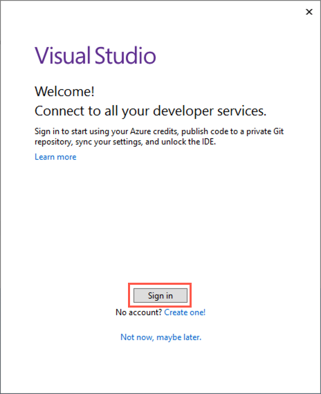
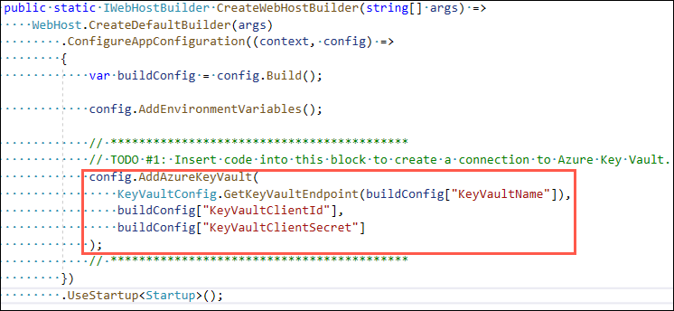
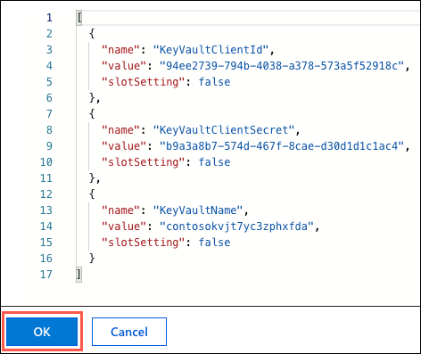
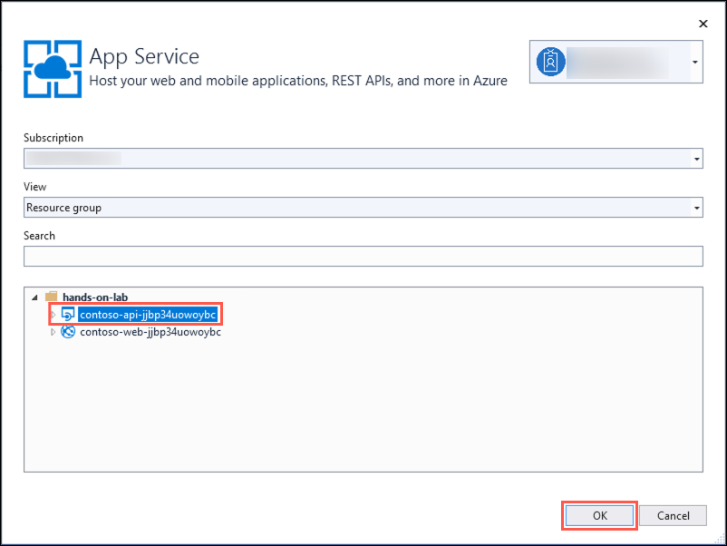
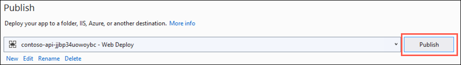
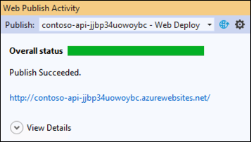

# App modernization hands-on lab step-by-step

## Abstract and learning objectives

In this hands-on lab, you implement the steps to modernize a legacy on-premises application, including upgrading and migrating the database to Azure and updating the application to take advantage of serverless and cloud services.

At the end of this hands-on lab, your ability to build solutions for modernizing legacy on-premises applications and infrastructure using cloud services will be improved.

## Overview

Contoso, Ltd. (Contoso) is a new company in an old business. Founded in Auckland, NZ, in 2011, they provide a full range of long-term insurance services to help individuals who are under-insured, filling a void their founders saw in the market. From the beginning, they grew faster than anticipated and have struggled to cope with rapid growth. During their first year alone, they added over 100 new employees to keep up with the demand for their services. To manage policies and associated documentation, they use a custom-developed Windows Forms application, called PolicyConnect. PolicyConnect uses an on-premises SQL Server 2008 R2 database as its data store, along with a file server on its local area network for storing policy documents. That application and its underlying processes for managing policies have become increasingly overloaded.

Contoso recently started a new web and mobile projects to allow policyholders, brokers, and employees to access policy information without requiring a VPN connection into the Contoso network. The web project is a new .NET Core 2.2 MVC web application, which accesses the PolicyConnect database using REST APIs. They eventually intend to share the REST APIs across all their applications, including the mobile app and WinForms version of PolicyConnect. They have a prototype of the web application running on-premises and are interested in taking their modernization efforts a step further by hosting the app in the cloud. However, they don't know how to take advantage of all the managed services of the cloud since they have no experience with it. They would like some direction converting what they have created so far into a more cloud-native application.

They have not started the development of a mobile app yet. Contoso is looking for guidance on how to take a .NET developer-friendly approach to implement the PolicyConnect mobile app on Android and iOS.

To prepare for hosting their applications in the cloud, they would like to migrate their SQL Server database to a PaaS SQL service in Azure. Contoso is hoping to take advantage of the advanced security features available in a fully-managed SQL service in the Azure. By migrating to the cloud, they hope to improve their technological capabilities and take advantage of enhancements and services that are enabled by moving to the cloud. The new features they would like to add are automated document forwarding from brokers, secure access for brokers, access to policy information, and reliable policy retrieval for a dispersed workforce. They have been clear that they will continue using the PolicyConnect WinForms application on-premises, but want to update the application to use cloud-based APIs and services. Additionally, they want to store policy documents in cloud storage for retrieval via the web and mobile apps.

## Solution architecture

Below is a high-level architecture diagram of the solution you implement in this hands-on lab. Please review this carefully, so you understand the whole of the solution as you are working on the various components.


The solution begins with migrating Contoso's SQL Server 2008 R2 database to Azure SQL Database using the Azure Database Migration Service (DMS). Using the Data Migration Assistant (DMA) assessment, Contoso determined that they can migrate into a fully-managed SQL database service in Azure. The assessment revealed no compatibility issues or unsupported features that would prevent them from using Azure SQL Database. Next, they deploy the web and API apps into Azure App Services. Also, mobile apps, built for Android and iOS using Xamarin, are created to provide remote access to PolicyConnect. The website, hosted in a Web App, provides the user interface for browser-based clients, whereas the Xamarin Forms-based app provides the UI for mobile devices. Both the mobile app and website rely on web services hosted in a Function App, which sits behind API Management. An API App is also deployed to host APIs for the legacy Windows Forms desktop application. Light-weight, serverless APIs are provided by Azure Functions and Azure Functions Proxies to provide access to the database and policy documents stored in Blob Storage.

Azure API Management is used to create an API Store for development teams and affiliated partners. Sensitive configuration data, like connection strings, are stored in Key Vault and accessed from the APIs or Web App on demand so that these settings never live in their file system. The API App implements the cache aside pattern using Azure Redis Cache. A full-text cognitive search pipeline is used to index policy documents in Blob Storage. Cognitive Services are used to enable search index enrichment using cognitive skills in Azure Search. PowerApps is used to enable authorized business users to build mobile and web create, read, update, delete (CRUD) applications. These apps interact with SQL Database and Azure Storage. Microsoft Flow enables them to orchestrations between services such as Office 365 email and services for sending mobile notifications. These orchestrations can be used independently of PowerApps or invoked by PowerApps to provide additional logic. The solution uses user and application identities maintained in Azure AD.

> **Note:** The solution provided is only one of many possible, viable approaches.

## Requirements

- Microsoft Azure subscription must be pay-as-you-go or MSDN.
  - Trial subscriptions will not work.
- A virtual machine configured with Visual Studio Community 2019 or higher (setup in the Before the hands-on lab exercises)
- **IMPORTANT**: To complete this lab, you must have sufficient rights within your Azure AD tenant to:
  - Create an Azure Active Directory application and service principal
  - Assign roles on your subscription
  - Register resource providers

## Exercise 4: Deploy Web API into Azure App Services

Duration: 45 minutes

The developers at Contoso have been working toward migrating their apps to the cloud, and they have provided you with a starter solution developed using ASP.NET Core 2.2. As such, most of the pieces are already in place to deploy the apps to Azure, as well as configure them to communicate with the new app services. Since the required services have already been provisioned, what remains is to integrate Azure Key Vault into the API, apply application-level configuration settings, and then deploy the apps from the Visual Studio starter solution. In this task, you apply application settings to the Web API using the Azure Portal. Once the application settings have been set, you deploy the Web App and API App into Azure from Visual Studio.

### Task 1: Connect to the LabVM

In this task, you open an RDP connection to the LabVM, and downloading a copy of the starter solution provided by Contoso. The application deployments are handled using Visual Studio 2019, installed on the LabVM.

1. In the [Azure portal](https://portal.azure.com), navigate to your **LabVM** virtual machine by selecting **Resource groups** from Azure services list, selecting the **hands-on-lab-SUFFIX** resource group, and selecting the **LabVM** virtual machine from the list of resources.

   

2. On the LabVM's **Overview** blade, select **Connect** on the top menu.

   

3. On the Connect to virtual machine blade, select **Download RDP File**, then open the downloaded RDP file.

4. Select **Connect** on the Remote Desktop Connection dialog.

5. Enter the following credentials when prompted, and then select **OK**:

   - **Username**: demouser
   - **Password**: Password.1!!

   

6. Select **Yes** to connect, if prompted that the identity of the remote computer cannot be verified.

   

### Task 2: Open starter solution with Visual Studio

In this task, you open the `Contoso` starter solution in Visual Studio. The Visual Studio solution contains the following projects:

- **Contoso.Azure**: Common library containing helper classes used by other projects within the solution to communicate with Azure services.
- **Contoso.Data**: Library containing data access objects.
- **Contoso.FunctionApp**: Contains an Azure Function that is used to retrieve policy documents from Blob storage.
- **Contoso.Web**: ASP.NET Core 2.2 PolicyConnect web application.
- **Contoso.WebApi**: ASP.NET Core 2.2 Web API used by the web application to communicate with the database.

1. In File Explorer, navigate to `C:\MCW\MCW-App-modernization-master\Hands-on lab\lab-files\src` and double-click the `Contoso.sln` file to open the solution in Visual Studio.

   

2. If prompted about how to open the file, select **Visual Studio 2019** and then select **OK**.

    

3. Sign in to Visual Studio using your Azure account credentials.

    

4. When prompted with a security warning, uncheck **Ask me for every project in this solution**, and then select **OK**.

    

### Task 3: Update Web API to use Key Vault

In this task, you update the `Contoso.WebApi` project to use Azure Key Vault for storing and retrieving application secrets. You start by adding the connection information to the `appsettings.json` file in the `Contoso.WebApi` project, and then add some code to enable the use of Azure Key Vault.

> The required NuGet package to enable interaction with Key Vault has already been referenced in the project to save time. The package added to facilitate this is: `Microsoft.Extensions.Configuration.AzureKeyVault`.

1. In Visual Studio, expand the `Contoso.WebApi` project in the Solution Explorer, locate the `Program.cs` file and open it by double-clicking on it.

    

2. In the `Program.cs` file, locate the `TODO #1` block (line 23) within the `CreateWebHostBuilder` method.

    

3. Complete the code within the block, using the following code, to add Key Vault to the configuration, and provide Key Vault with the appropriate connection information.

    ```csharp
    config.AddAzureKeyVault(
        KeyVaultConfig.GetKeyVaultEndpoint(buildConfig["KeyVaultName"]),
        buildConfig["KeyVaultClientId"],
        buildConfig["KeyVaultClientSecret"]
    );
    ```

4. Save `Program.cs`. The updated `CreateWebHostBuilder` method should now look like the following:

    

5. Next, you update the `Startup.cs` file in the `Contoso.WebApi` project. Locate the file in the Solution Explorer and double-click it.

6. In the previous exercise, you added the connection string for your Azure SQL Database to Key Vault, and assigned the secret a name of `SqlConnectionString`. Using the code below, update the `TODO #2` block (line 38), within the `Startup.cs` file's `Configuration` property. This allows your application to retrieve the connection string from Key Vault using the secret name.

    

    ```csharp
    services.AddDbContext<ContosoDbContext>(options =>
        options.UseSqlServer(Configuration["SqlConnectionString"]));
    ```

7. Save `Startup.cs`. The updated `Configuration` property now looks like the following:

    

8. Your Web API is now fully configured to retrieve secrets from Azure Key Vault.

### Task 4: Copy KeyVault configuration section to API App in Azure

Before deploying the Web API to Azure, you need to add the required application settings into the configuration for the Azure API App. In this task, you use the advanced configuration editor in your API App to add in the configuration settings required to connect to and retrieve secrets from Key Vault.

1. In the [Azure portal](https://portal.azure.com), navigate to your **API App** by selecting **Resource groups** from Azure services list, selecting the **hands-on-lab-SUFFIX** resource group, and selecting the **contoso-api-UniqueId** App service from the list of resources.

   

2. On the API App blade, select **Configuration** on the left-hand menu.

    

3. On the Application settings tab of the Configuration blade, select **Advanced edit** under Application settings. The Advanced edit screen allows you to paste JSON directly into the configuration.

    

4. We are going to use the Advanced editor to add all three of the Key Vault settings at once. To do this, we are going to replace the content of the Advanced editor with the following, which you need to update as follows:

    - `<your-key-vault-name>`: Replace this with the name of your Key Vault, which you copied into a text editor in in the previous exercise.
    - `<your-service-principal-application-id>`: Replace this with the `appId` value you received as output when you created the service principal.
    - `<your-service-principal-password>`: Replace this with the `password` value you received as output when you created the service principal.

    ```json
    [
        {
            "name": "KeyVaultName",
            "value": "<your-key-vault-name>"
        },
        {
            "name": "KeyVaultClientId",
            "value": "<your-service-principal-application-id>"
        },
        {
            "name": "KeyVaultClientSecret",
            "value": "<your-service-principal-password>"
        }
    ]
    ```

5. The final contents of the editor should look similar to the following:

    ```json
    [
        {
            "name": "KeyVaultName",
            "value": "contosokvjt7yc3zphxfda"
        },
        {
            "name": "KeyVaultClientId",
            "value": "94ee2739-794b-4038-a378-573a5f52918c"
        },
        {
            "name": "KeyVaultClientSecret",
            "value": "b9a3a8b7-574d-467f-8cae-d30d1d1c1ac4"
        }
    ]
    ```

6. Select **OK**.

    

7. Select **Save** on the Configuration blade.

    

### Task 5: Deploy the API to Azure

In this task, you use Visual Studio to deploy the API project into an API App in Azure.

1. In Visual Studio, right-click on the **Contoso.WebApi** project in the Solution Explorer and select **Publish** from the context menu.

    

2. On the **Pick a publish target** dialog, select **App Service** and choose **Select Existing**, and then select **Create Profile**.

    

3. On the App Service dialog, select your Azure subscription, logging in if necessary on with your credentials and ensure the subscription you published earlier is selected, then select your API App (resource starting with "contoso-**api**") under your hands-on-lab-SUFFIX resource group.

    

4. Select **OK**.

5. Back on the Visual Studio Publish page for the `Contoso.WebApi` project, select **Publish** to start the process of publishing your Web API to your Azure API App.

    

6. In the Visual Studio **Web Publish Activity** view, you should see a status that indicates the Web API was published successfully, along with the URL to the site.

    

    > If you don't see the **Web Publish Activity** view, you can find it on View menu-> Other Windows -> Microsoft Azure Activity Log.

7. A web browser should open to the published site. If not, open the URL of the published Web API in a browser window. Initially, you should see a message that the page cannot be found.

    

8. To validate the API App is function property, add `/swagger` to the end of the URL in your browser's address bar (e.g., <https://contoso-api-jjbp34uowoybc.azurewebsites.net/swagger/>). This brings up the Swagger UI page of your API, which displays a list of the available API endpoints.

    

    > **Note**: [Swagger UI](https://swagger.io/tools/swagger-ui/) automatically generates visual documentation for REST APIs following the OpenAPI Specification. It makes it easy for developers to visualize and interact with the API's endpoints without having any of the implementation logic in place.

9. You can test the functionality of the API by selecting one of the `GET` endpoints, and selecting **Try it out**.

    

10. Select **Execute**.

    

11. In the Response, you should see a Response Code of 200, and JSON objects in the Response body.

    