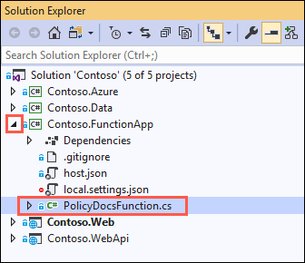
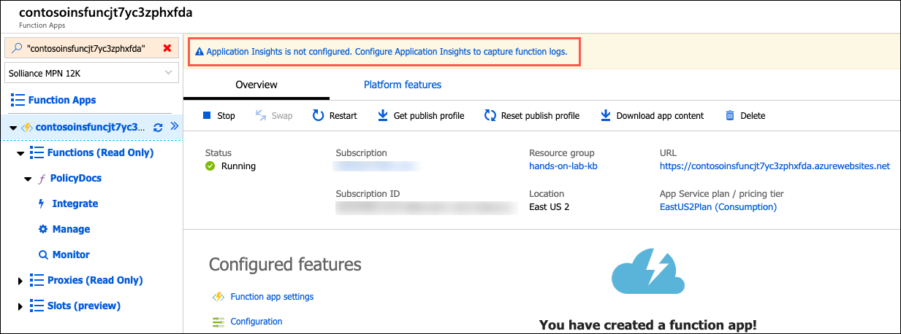
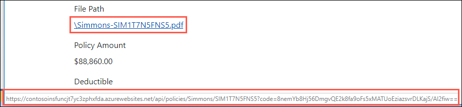

# App modernization hands-on lab step-by-step

## Abstract and learning objectives

In this hands-on lab, you implement the steps to modernize a legacy on-premises application, including upgrading and migrating the database to Azure and updating the application to take advantage of serverless and cloud services.

At the end of this hands-on lab, your ability to build solutions for modernizing legacy on-premises applications and infrastructure using cloud services will be improved.

## Overview

Contoso, Ltd. (Contoso) is a new company in an old business. Founded in Auckland, NZ, in 2011, they provide a full range of long-term insurance services to help individuals who are under-insured, filling a void their founders saw in the market. From the beginning, they grew faster than anticipated and have struggled to cope with rapid growth. During their first year alone, they added over 100 new employees to keep up with the demand for their services. To manage policies and associated documentation, they use a custom-developed Windows Forms application, called PolicyConnect. PolicyConnect uses an on-premises SQL Server 2008 R2 database as its data store, along with a file server on its local area network for storing policy documents. That application and its underlying processes for managing policies have become increasingly overloaded.

Contoso recently started a new web and mobile projects to allow policyholders, brokers, and employees to access policy information without requiring a VPN connection into the Contoso network. The web project is a new .NET Core 2.2 MVC web application, which accesses the PolicyConnect database using REST APIs. They eventually intend to share the REST APIs across all their applications, including the mobile app and WinForms version of PolicyConnect. They have a prototype of the web application running on-premises and are interested in taking their modernization efforts a step further by hosting the app in the cloud. However, they don't know how to take advantage of all the managed services of the cloud since they have no experience with it. They would like some direction converting what they have created so far into a more cloud-native application.

They have not started the development of a mobile app yet. Contoso is looking for guidance on how to take a .NET developer-friendly approach to implement the PolicyConnect mobile app on Android and iOS.

To prepare for hosting their applications in the cloud, they would like to migrate their SQL Server database to a PaaS SQL service in Azure. Contoso is hoping to take advantage of the advanced security features available in a fully-managed SQL service in the Azure. By migrating to the cloud, they hope to improve their technological capabilities and take advantage of enhancements and services that are enabled by moving to the cloud. The new features they would like to add are automated document forwarding from brokers, secure access for brokers, access to policy information, and reliable policy retrieval for a dispersed workforce. They have been clear that they will continue using the PolicyConnect WinForms application on-premises, but want to update the application to use cloud-based APIs and services. Additionally, they want to store policy documents in cloud storage for retrieval via the web and mobile apps.

## Solution architecture

Below is a high-level architecture diagram of the solution you implement in this hands-on lab. Please review this carefully, so you understand the whole of the solution as you are working on the various components.


The solution begins with migrating Contoso's SQL Server 2008 R2 database to Azure SQL Database using the Azure Database Migration Service (DMS). Using the Data Migration Assistant (DMA) assessment, Contoso determined that they can migrate into a fully-managed SQL database service in Azure. The assessment revealed no compatibility issues or unsupported features that would prevent them from using Azure SQL Database. Next, they deploy the web and API apps into Azure App Services. Also, mobile apps, built for Android and iOS using Xamarin, are created to provide remote access to PolicyConnect. The website, hosted in a Web App, provides the user interface for browser-based clients, whereas the Xamarin Forms-based app provides the UI for mobile devices. Both the mobile app and website rely on web services hosted in a Function App, which sits behind API Management. An API App is also deployed to host APIs for the legacy Windows Forms desktop application. Light-weight, serverless APIs are provided by Azure Functions and Azure Functions Proxies to provide access to the database and policy documents stored in Blob Storage.

Azure API Management is used to create an API Store for development teams and affiliated partners. Sensitive configuration data, like connection strings, are stored in Key Vault and accessed from the APIs or Web App on demand so that these settings never live in their file system. The API App implements the cache aside pattern using Azure Redis Cache. A full-text cognitive search pipeline is used to index policy documents in Blob Storage. Cognitive Services are used to enable search index enrichment using cognitive skills in Azure Search. PowerApps is used to enable authorized business users to build mobile and web create, read, update, delete (CRUD) applications. These apps interact with SQL Database and Azure Storage. Microsoft Flow enables them to orchestrations between services such as Office 365 email and services for sending mobile notifications. These orchestrations can be used independently of PowerApps or invoked by PowerApps to provide additional logic. The solution uses user and application identities maintained in Azure AD.

> **Note:** The solution provided is only one of many possible, viable approaches.

## Requirements

- Microsoft Azure subscription must be pay-as-you-go or MSDN.
  - Trial subscriptions will not work.
- A virtual machine configured with Visual Studio Community 2019 or higher (setup in the Before the hands-on lab exercises)
- **IMPORTANT**: To complete this lab, you must have sufficient rights within your Azure AD tenant to:
  - Create an Azure Active Directory application and service principal
  - Assign roles on your subscription
  - Register resource providers
  
## Exercise 7: Create serverless API for accessing PDFs

Duration: 30 minutes

Contoso has made some updates to prepare their applications, but there are some features that they have not been able to build into the API yet. They have requested that you assist them in setting up a proof-of-concept (POC) API solution to enable users of their application to retrieve their policy documents directly from their Azure Storage account. In this exercise, you create an Azure Function to enable this functionality using serverless technologies.

### Task 1: Add application settings to your Function App

In this task, you prepare your Azure Function App to work with your new Function by adding your storage account policies container URL and SAS token values to the Application Settings of your Function App, using the Azure Cloud Shell and Azure CLI.

1. In the [Azure portal](https://portal.azure.com), select the Azure Function and go to Configuration.

2. Advance edit and add this settings where `{PoliciesUrl}` is policies container URL and `{SAS}` is Shared Access Token that you copied into a text editor previouly:

```JSON
  {
    "name": "PolicyStorageUrl",
    "value": "{PoliciesUrl}",
    "slotSetting": false
  },
  {
    "name": "PolicyStorageSas",
    "value": "{SAS}",
    "slotSetting": false
  }
```
3. Save and continue.

### Task 2: Add project environment variables

Functions can use environment variables to retrieve configuration settings. To test your functions locally using environment variables, you must add these settings as user environment variables on your development machine or to the project settings.

In this task, you create some environment variables on your LabVM, which allows for debugging your Function App locally on the LabVM.

1. In Solution Explorer, right-click the **Contoso-FunctionApp** project, then select **Properties**

2. Select the **Debug** tab.

3. In the **Environment Variables** section, choose **Add**, then enter the following:

    - **Name**: Enter **PolicyStorageSas**
    - **Value**: Paste in the **SAS token** you created and copied into a text editor in the previous exercise.

4. Select **OK**.

5. Select **Add** again, and in the New User Variable dialog, enter the following:

    - **Name**: Enter **PolicyStorageUrl**
    - **Value**: Paste in the **URL** of the policies container you copied into a text editor in the previous exercise.

    

6. Save the project.

### Task 3: Create an Azure Function in Visual Studio

In this task, you use Visual Studio to create an Azure Function. This Function serves as a serverless API for retrieving policy documents from Blob storage.

1. On your LabVM, return to Visual Studio and in the Solution explorer expand the `Contoso.FunctionApp` and then double-click `PolicyDocsFunction.cs` to open it.

    

2. In the `PolicyDocsFunction.cs` file, locate the `TODO #3` block (begins on line 14).

    

3. Update the code within the block to allow passing in the policy holder last and policy number. Also, update it to only allow "get" requests. The updated code should look like the below when completed.

    ```csharp
    [FunctionName("PolicyDocs")]
        public static async Task<IActionResult> Run(
                [HttpTrigger(AuthorizationLevel.Function, "get", Route = "policies/{policyHolder}/{policyNumber}")] HttpRequest req, string policyHolder, string policyNumber, ILogger log)
    ```

    > **Note**: Notice that in the code you removed `"post"` from the list of acceptable verbs, and then updated the Route of the HttpTrigger from `null` to `policies/{policyHolder}/{policyNumber}`. This allows for the function to be parameterized. You then added `string` parameters to the Run method to allow those parameters to be received and used within the function.

4. Next, locate `TODO #4` within the `GetDocumentsFromStorage` method in the `PolicyDocsFunction.cs` file.

    

5. Update the code in the block to retrieve the `PolicyStorageUrl` and `PolicyStorageSas` values from the environment variables you added above. The completed code should look like the following:

    ```csharp
    var containerUri = Environment.GetEnvironmentVariable("PolicyStorageUrl");
    var sasToken = Environment.GetEnvironmentVariable("PolicyStorageSas");
    ```

    > **Note**: When the API is deployed to an Azure API App, `Environment.GetEnvironmentVariables()` looks for the specified values in the configured application settings.

6. Save `PolicyDocsFunction.cs`.

7. Take a moment to review the code in the Function, and understand how it functions. It uses an `HttpTrigger`, which means the function executes whenever it receives an Http request. You added configuration to restrict the Http requests to only `GET` requests, and the requests must be in format `https://<function-name>.azurewebsites.net/policies/{policyHolder}/{policyName}` for the Function App to route the request to the `PolicyDocs` function. Within the function, an Http request is being made to your Storage account `policy` container URL to retrieve the PDF document for the specified policy holder and policy number. That is then returned to the browser as a PDF attachment.

8. Your Function App is now fully configured to retrieve parameterized values and then retrieve documents from the `policies` container in your Storage account.

### Task 4: Test the function locally

In this task, you run your Function locally through the Visual Studio debugger, to verify that it is properly configured and able to retrieve documents from the `policy` container in your Storage account.

> **IMPORTANT**: Internet Explorer on Windows Server 2019 does not include functionality to open PDF documents. To view the downloaded policy documents in this task, you need to [download and install the Chrome browser](https://www.google.com/chrome/) on your LabVM.

1. In the Visual Studio Solution Explorer, right-click the `Contoso.FunctionApp` project, and then select **Debug** and **Start new instance**.

    

2. If prompted, allow the function app to access your local machine resources.

3. A new console dialog appears, and the function app is loaded. At the of the console, note the output, which provides the local URL of the Function.

    

4. Copy the URL that appears after `PolicyDocs`, and paste it into a text editor. The copied value should look like:

    ```http
    http://localhost:7071/api/policies/{policyHolder}/{policyNumber}
    ```

5. In the text editor, you need to replace the tokenized values as follows:

   - `{policyHolder}`: Acevedo
   - `{policyNumber}`: ACE5605VZZ2ACQ

    The updated URL should now look like:

    ```http
    http://localhost:7071/api/policies/Acevedo/ACE5605VZZ2ACQ
    ```

6. Paste the updated into the address bar of a new Chrome web browser window and press Enter.

7. In the browser, the policy document opens in a new window.

    

8. You've confirmed the function is working properly. Stop your Visual Studio debugging session by closing the console window or selecting the stop button on the Visual Studio toolbar. In the next task, you deploy the function to Azure.

### Task 5: Deploy the function to your Azure Function App

In this task, you deploy your function into an Azure Function App, where the web application uses it to retrieve policy documents.

1. In Visual Studio on your LabVM, right-click on the `Contoso.FunctionApp` project in the Solution Explorer, and then select **Publish** from the context menu.

    

2. On the **Pick a publish target** dialog, select **Azure Functions Consumption Plan**, choose **Select Existing**, leave Run from package file checked, and then select **Create Profile**.

    

3. On the App Service dialog, select your Azure subscription, logging in if necessary on with your credentials and ensure the subscription you published earlier is selected, then select your Function App (resource starting with "contoso-**func**") under your hands-on-lab-SUFFIX resource group.

    

4. Select **OK**.

5. Back on the Visual Studio Publish page for the `Contoso.FunctionApp` project, select **Publish** to start the process of publishing your Web API to your Azure API App.

    

6. Ensure you see a publish succeeded message in the Visual Studio Output panel.

7. The Azure Function App is now ready for use within the PolicyConnect web application.

### Task 6: Enable Application Insights on the Function App

In this task, you add Application Insights to your Function App in the Azure Portal, to be able to collect insights into requests against the Function.

1. In the [Azure portal](https://portal.azure.com), navigate to your **Function App** by selecting **Resource groups** from Azure services list, selecting the **hands-on-lab-SUFFIX** resource group, and selecting the **contoso-func-UniqueId** App service from the list of resources.

   

2. On the Function App blade, select **Configure Application Insights to capture function logs.** at the top of the blade.

    

3. On the Application Insights blade, select **Create new resource** and enter a globally unique name, such as contoso-ai-SUFFIX, and then select **OK**.

    

4. Once the Application Insights resource is created, return to the Overview blade of your Function App, and select **Application Insights** under Configured Features.

    

5. On the Application Insights blade, select **Live Metrics Stream** from the left-hand menu.

    

    > **Note**: You may see a message that your app is offline. You handle this below.

6. Leave the Live Metrics Stream window open for reference in the next task.

### Task 7: Add Function App URL to your Web App Application settings

In this task, you add the URL of your Azure Function App to the Application settings configuration of your Web App.

1. In the [Azure portal](https://portal.azure.com), go to Function **PolicyDocs** in Function App and press *Get Function Url*.

    

2. Copy url and create a new setting called `PolicyDocumentsPath` in web app:
    

3. Save and Continue

### Task 8: Test document retrieval from web app

In this task, you open the PolicyConnect web app and download a policy document. Recall from above that this resulted in a page not found error when you tried it previously.

1. In Visual Studio, uncomment this line and comment next line. Then, publish Web App again.

    

2. Open a web browser and navigate to the URL for your published Web App.

    > **Note**: You can retrieve the URL from the Overview blade of your Web App resource in the Azure portal if you aren't sure what it is.

    

3. In the PolicyConnect web page, enter the following credentials to log in, and then select **Log in**:

    - **Username**: demouser
    - **Password**: Password.1!!

    

4. Once logged in, select **Managed Policy Holders** from the top menu.

    

5. On the Policy Holders page, you see a list of policy holders, and information about their policies. This information was pulled from your Azure SQL Database using the connection string stored in Azure Key Vault. Select the **Details** link next to one of the records.

    

6. On the Policy Holder Details page, hover your mouse cursor over the document link under **File Path**, and notice that the path that is displayed at the bottom now points to your Function App, and that the policy holder's last name and policy number are inserted into the path.

    

7. Now, select the link under **File Path**, and download the policy document.

    

### Task 9: View Live Metrics Stream

1. Return to the Application Insights Live Metrics Stream in the Azure portal.

2. The page should now display a dashboard featuring telemetry for requests hitting your Function App. Look under the Sample Telemetry section on the right, and you locate the document request you just made. Select the Trace whose message begins with "PolicyDocs function received a request...", and observe the details in the panel below it.

    