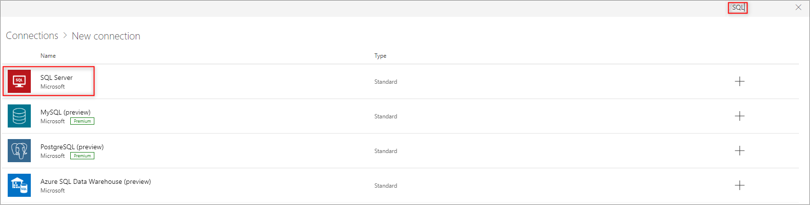
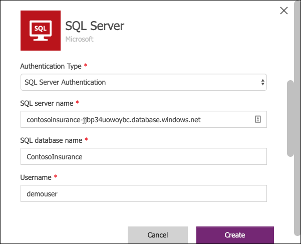
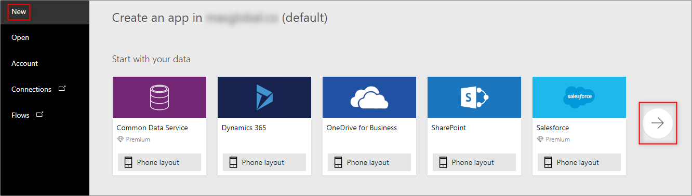
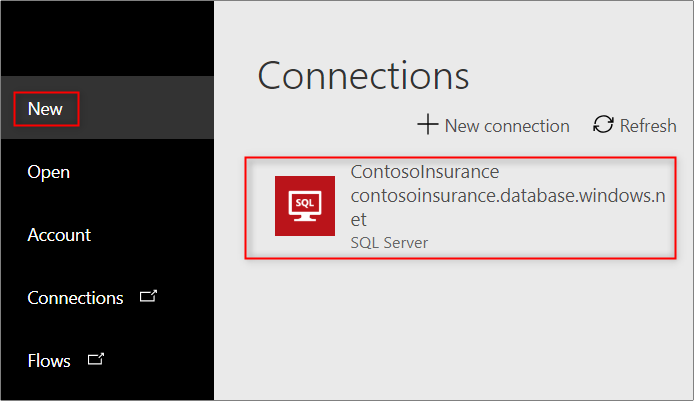
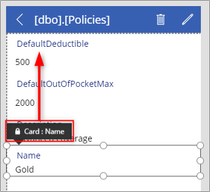
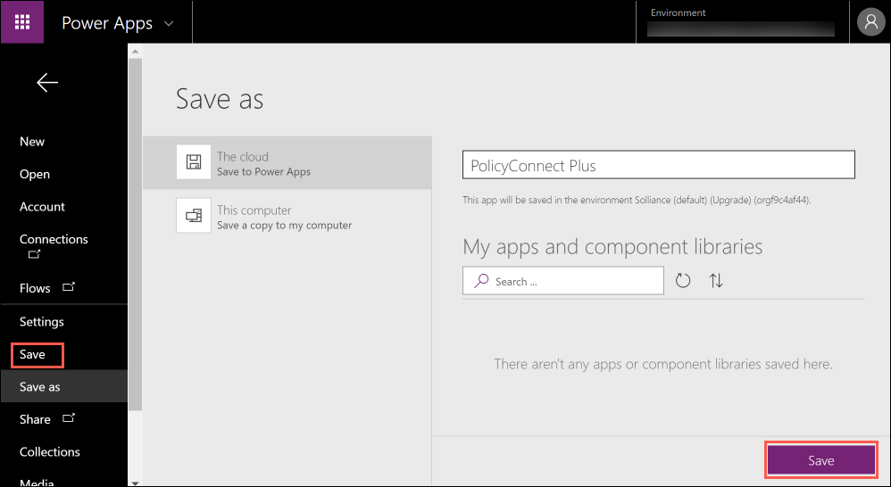

# App modernization hands-on lab step-by-step

## Abstract and learning objectives

In this hands-on lab, you implement the steps to modernize a legacy on-premises application, including upgrading and migrating the database to Azure and updating the application to take advantage of serverless and cloud services.

At the end of this hands-on lab, your ability to build solutions for modernizing legacy on-premises applications and infrastructure using cloud services will be improved.

## Overview

Contoso, Ltd. (Contoso) is a new company in an old business. Founded in Auckland, NZ, in 2011, they provide a full range of long-term insurance services to help individuals who are under-insured, filling a void their founders saw in the market. From the beginning, they grew faster than anticipated and have struggled to cope with rapid growth. During their first year alone, they added over 100 new employees to keep up with the demand for their services. To manage policies and associated documentation, they use a custom-developed Windows Forms application, called PolicyConnect. PolicyConnect uses an on-premises SQL Server 2008 R2 database as its data store, along with a file server on its local area network for storing policy documents. That application and its underlying processes for managing policies have become increasingly overloaded.

Contoso recently started a new web and mobile projects to allow policyholders, brokers, and employees to access policy information without requiring a VPN connection into the Contoso network. The web project is a new .NET Core 2.2 MVC web application, which accesses the PolicyConnect database using REST APIs. They eventually intend to share the REST APIs across all their applications, including the mobile app and WinForms version of PolicyConnect. They have a prototype of the web application running on-premises and are interested in taking their modernization efforts a step further by hosting the app in the cloud. However, they don't know how to take advantage of all the managed services of the cloud since they have no experience with it. They would like some direction converting what they have created so far into a more cloud-native application.

They have not started the development of a mobile app yet. Contoso is looking for guidance on how to take a .NET developer-friendly approach to implement the PolicyConnect mobile app on Android and iOS.

To prepare for hosting their applications in the cloud, they would like to migrate their SQL Server database to a PaaS SQL service in Azure. Contoso is hoping to take advantage of the advanced security features available in a fully-managed SQL service in the Azure. By migrating to the cloud, they hope to improve their technological capabilities and take advantage of enhancements and services that are enabled by moving to the cloud. The new features they would like to add are automated document forwarding from brokers, secure access for brokers, access to policy information, and reliable policy retrieval for a dispersed workforce. They have been clear that they will continue using the PolicyConnect WinForms application on-premises, but want to update the application to use cloud-based APIs and services. Additionally, they want to store policy documents in cloud storage for retrieval via the web and mobile apps.

## Solution architecture

Below is a high-level architecture diagram of the solution you implement in this hands-on lab. Please review this carefully, so you understand the whole of the solution as you are working on the various components.

The solution begins with migrating Contoso's SQL Server 2008 R2 database to Azure SQL Database using the Azure Database Migration Service (DMS). Using the Data Migration Assistant (DMA) assessment, Contoso determined that they can migrate into a fully-managed SQL database service in Azure. The assessment revealed no compatibility issues or unsupported features that would prevent them from using Azure SQL Database. Next, they deploy the web and API apps into Azure App Services. Also, mobile apps, built for Android and iOS using Xamarin, are created to provide remote access to PolicyConnect. The website, hosted in a Web App, provides the user interface for browser-based clients, whereas the Xamarin Forms-based app provides the UI for mobile devices. Both the mobile app and website rely on web services hosted in a Function App, which sits behind API Management. An API App is also deployed to host APIs for the legacy Windows Forms desktop application. Light-weight, serverless APIs are provided by Azure Functions and Azure Functions Proxies to provide access to the database and policy documents stored in Blob Storage.

Azure API Management is used to create an API Store for development teams and affiliated partners. Sensitive configuration data, like connection strings, are stored in Key Vault and accessed from the APIs or Web App on demand so that these settings never live in their file system. The API App implements the cache aside pattern using Azure Redis Cache. A full-text cognitive search pipeline is used to index policy documents in Blob Storage. Cognitive Services are used to enable search index enrichment using cognitive skills in Azure Search. PowerApps is used to enable authorized business users to build mobile and web create, read, update, delete (CRUD) applications. These apps interact with SQL Database and Azure Storage. Microsoft Flow enables them to orchestrations between services such as Office 365 email and services for sending mobile notifications. These orchestrations can be used independently of PowerApps or invoked by PowerApps to provide additional logic. The solution uses user and application identities maintained in Azure AD.

> **Note:** The solution provided is only one of many possible, viable approaches.

## Requirements

- Microsoft Azure subscription must be pay-as-you-go or MSDN.
  - Trial subscriptions will not work.
- A virtual machine configured with Visual Studio Community 2019 or higher (setup in the Before the hands-on lab exercises)
- **IMPORTANT**: To complete this lab, you must have sufficient rights within your Azure AD tenant to:
  - Create an Azure Active Directory application and service principal
  - Assign roles on your subscription
  - Register resource providers

## Exercise 9: Create an app in PowerApps

Duration: 15 minutes

Since creating mobile apps is a long development cycle, Contoso is interested in using PowerApps to create mobile applications to add functionality not currently offered by their app rapidly. In this scenario, they want to be able to edit the Policy lookup values (Silver, Gold, Platinum, etc.), which they are unable to do in the current app. In this task, you get them up and running with a new app created in PowerApps, which connects to the `ContosoInsurance` database and performs basic CRUD (Create, Read, Update, and Delete) operations against the Policies table.

### Task 1: Sign up for a PowerApps account

1. Go to <https://web.powerapps.com> and sign up for a new account, using the same account you have been using in Azure.

2. You may receive an email asking you to verify your account request, with a link to continue the process.

3. Download and install **PowerApps Studio** from the Microsoft store: <https://www.microsoft.com/en-us/store/p/powerapps/9nblggh5z8f3>.

> **Note**: If you are unable to install PowerApps on the LabVM, you can run install it on your local machine and run the steps for this exercise there.

### Task 2: Create new SQL connection

1. From the PowerApps website, expand the **Data** option from the left-hand navigation menu, then select **Connections**.

2. Select the **+ New connection** button.

    

3. Type **SQL** into the search box, and then select the SQL Server item in the list below.

    

4. Within the SQL Server connection dialog, enter the following:

   - **Authentication Type**: Select **SQL Server Authentication**.
   - **SQL Server name**: Enter the server name of your Azure SQL database. For example, `contosoinsurance-jjbp34uowoybc.database.windows.net`.
   - **SQL Database name**: Enter **ContosoInsurance**
   - **Username**: Enter **demouser**
   - **Password**: Enter **Password.1!!**

    

5. Select **Create**.

### Task 3: Create a new app

1. Open the PowerApps Studio application you downloaded previously and sign in with your PowerApps account.

2. Select **New** on the left-hand side and in the browser windows that opens confirm your country/region and select **Get started**.

3. Then **select the right arrow** next to the **Start with your data** list.

    

4. Select the **SQL Server connection** you created in the previous task.

    

5. Select the **policies** table from the Choose a table list.

    

6. Select **Connect**.

### Task 4: Design app

1. The new app is automatically created and displayed within the designer. Select the title for the first page (currently named [dbo].[Policies]) and edit the text in the field to read **Policies**.

    

2. Select the **DetailScreen1** screen in the left-hand menu.

    

3. Reorder the fields on the form by selecting them, then dragging them by the **Card: <field_name>** tag to the desired location. The new order should be **Name**, **Description**, **DefaultDeductible**, then **DefaultOutOfPocketMax**.

    

4. On the form, edit the **DefaultDeductible** and **DefaultOutOfPocketMax** labels to be **Default Deductible** and **Default Out of Pocket Max**, respectively. To do so, select the field and type the new title in quotes within the formula field.

    > **Hint**: You need to select **Unlock** in order to change fields.

5. Rename the screen title to Policy by typing "Policy" in quotation marks within the formula field.

    

6. Select EditScreen on the left-hand menu.

7. Repeat steps 4-6 on the edit screen.

### Task 5: Edit the app settings and run the app

1. Select **File** on the top menu.

    

2. Select **Name + icon** under Settings and enter in a new **Name**, such as "PolicyConnect Plus".

    

3. Select **Save** on the left-hand menu to save the app to the cloud, then select the **Save** button below.

    

4. After saving, select the left arrow on top of the left-hand menu.

    

5. Select **BrowseScreen1** from the left-hand menu and then select the **Run** button on the top menu to preview the app. You should be able to view the current policies, edit their values, and create new policies.

    

6. Browse through the various policies in the app to explore the functionality.