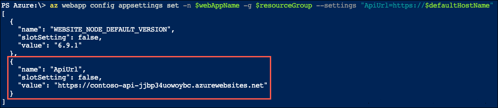
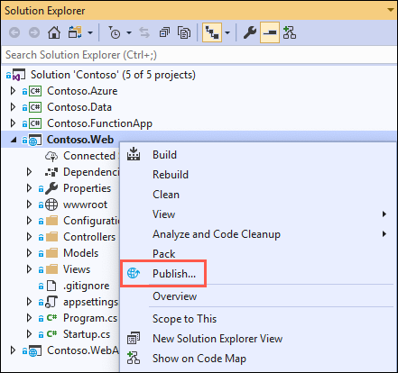
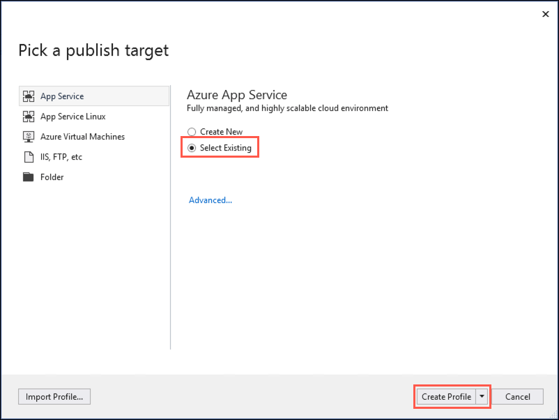
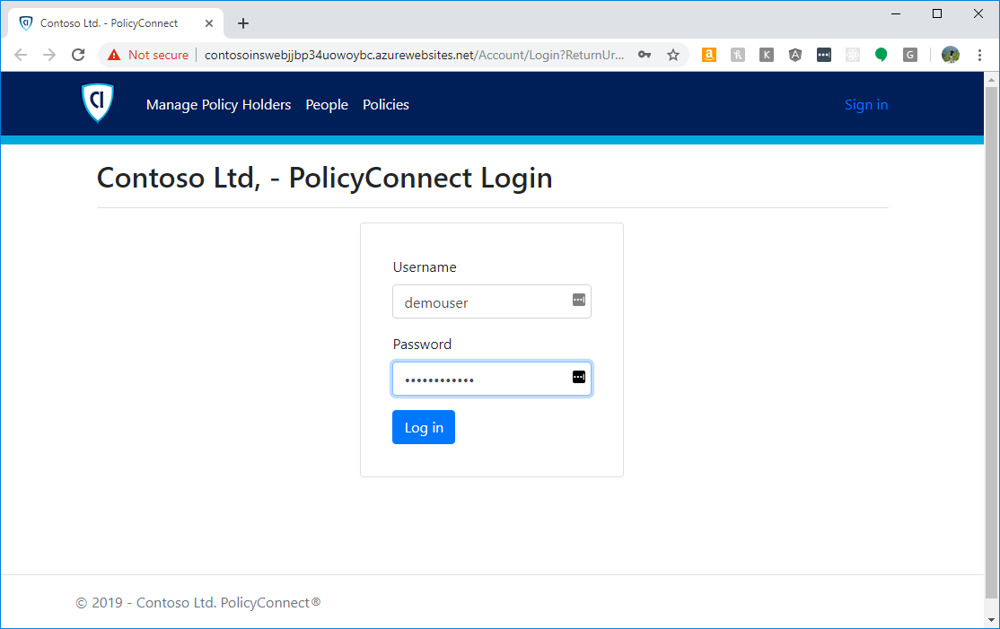
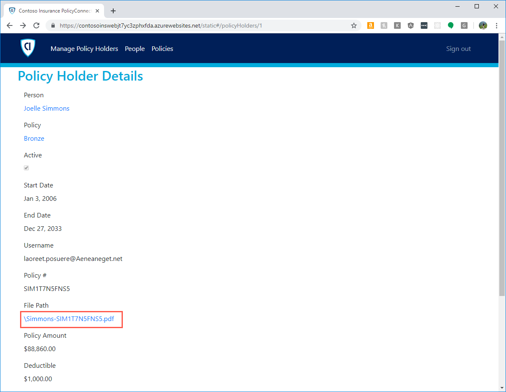

# App modernization hands-on lab step-by-step

## Abstract and learning objectives

In this hands-on lab, you implement the steps to modernize a legacy on-premises application, including upgrading and migrating the database to Azure and updating the application to take advantage of serverless and cloud services.

At the end of this hands-on lab, your ability to build solutions for modernizing legacy on-premises applications and infrastructure using cloud services will be improved.

## Overview

Contoso, Ltd. (Contoso) is a new company in an old business. Founded in Auckland, NZ, in 2011, they provide a full range of long-term insurance services to help individuals who are under-insured, filling a void their founders saw in the market. From the beginning, they grew faster than anticipated and have struggled to cope with rapid growth. During their first year alone, they added over 100 new employees to keep up with the demand for their services. To manage policies and associated documentation, they use a custom-developed Windows Forms application, called PolicyConnect. PolicyConnect uses an on-premises SQL Server 2008 R2 database as its data store, along with a file server on its local area network for storing policy documents. That application and its underlying processes for managing policies have become increasingly overloaded.

Contoso recently started a new web and mobile projects to allow policyholders, brokers, and employees to access policy information without requiring a VPN connection into the Contoso network. The web project is a new .NET Core 2.2 MVC web application, which accesses the PolicyConnect database using REST APIs. They eventually intend to share the REST APIs across all their applications, including the mobile app and WinForms version of PolicyConnect. They have a prototype of the web application running on-premises and are interested in taking their modernization efforts a step further by hosting the app in the cloud. However, they don't know how to take advantage of all the managed services of the cloud since they have no experience with it. They would like some direction converting what they have created so far into a more cloud-native application.

They have not started the development of a mobile app yet. Contoso is looking for guidance on how to take a .NET developer-friendly approach to implement the PolicyConnect mobile app on Android and iOS.

To prepare for hosting their applications in the cloud, they would like to migrate their SQL Server database to a PaaS SQL service in Azure. Contoso is hoping to take advantage of the advanced security features available in a fully-managed SQL service in the Azure. By migrating to the cloud, they hope to improve their technological capabilities and take advantage of enhancements and services that are enabled by moving to the cloud. The new features they would like to add are automated document forwarding from brokers, secure access for brokers, access to policy information, and reliable policy retrieval for a dispersed workforce. They have been clear that they will continue using the PolicyConnect WinForms application on-premises, but want to update the application to use cloud-based APIs and services. Additionally, they want to store policy documents in cloud storage for retrieval via the web and mobile apps.

## Solution architecture

Below is a high-level architecture diagram of the solution you implement in this hands-on lab. Please review this carefully, so you understand the whole of the solution as you are working on the various components.


The solution begins with migrating Contoso's SQL Server 2008 R2 database to Azure SQL Database using the Azure Database Migration Service (DMS). Using the Data Migration Assistant (DMA) assessment, Contoso determined that they can migrate into a fully-managed SQL database service in Azure. The assessment revealed no compatibility issues or unsupported features that would prevent them from using Azure SQL Database. Next, they deploy the web and API apps into Azure App Services. Also, mobile apps, built for Android and iOS using Xamarin, are created to provide remote access to PolicyConnect. The website, hosted in a Web App, provides the user interface for browser-based clients, whereas the Xamarin Forms-based app provides the UI for mobile devices. Both the mobile app and website rely on web services hosted in a Function App, which sits behind API Management. An API App is also deployed to host APIs for the legacy Windows Forms desktop application. Light-weight, serverless APIs are provided by Azure Functions and Azure Functions Proxies to provide access to the database and policy documents stored in Blob Storage.

Azure API Management is used to create an API Store for development teams and affiliated partners. Sensitive configuration data, like connection strings, are stored in Key Vault and accessed from the APIs or Web App on demand so that these settings never live in their file system. The API App implements the cache aside pattern using Azure Redis Cache. A full-text cognitive search pipeline is used to index policy documents in Blob Storage. Cognitive Services are used to enable search index enrichment using cognitive skills in Azure Search. PowerApps is used to enable authorized business users to build mobile and web create, read, update, delete (CRUD) applications. These apps interact with SQL Database and Azure Storage. Microsoft Flow enables them to orchestrations between services such as Office 365 email and services for sending mobile notifications. These orchestrations can be used independently of PowerApps or invoked by PowerApps to provide additional logic. The solution uses user and application identities maintained in Azure AD.

> **Note:** The solution provided is only one of many possible, viable approaches.

## Requirements

- Microsoft Azure subscription must be pay-as-you-go or MSDN.
  - Trial subscriptions will not work.
- A virtual machine configured with Visual Studio Community 2019 or higher (setup in the Before the hands-on lab exercises)
- **IMPORTANT**: To complete this lab, you must have sufficient rights within your Azure AD tenant to:
  - Create an Azure Active Directory application and service principal
  - Assign roles on your subscription
  - Register resource providers

## Exercise 5: Deploy web application into Azure App Services

Duration: 10 minutes

In this exercise, you update the `Contoso.Web` web application to connect to your newly deployed API App and then deploy the web app into Azure App Services.

### Task 1: Add API App URL to Web App Application settings

In this task, you prepare your Web App to work with the API App by adding the URL of your published API App to the Application Settings of your Web App, using the Azure Cloud Shell and Azure CLI.

1. In the [Azure portal](https://portal.azure.com), select the Azure Cloud Shell icon from the menu at the top right of the screen.

    

2. In the Cloud Shell window that opens at the bottom of your browser window, select **PowerShell**.

    

3. After a moment, you are presented with a PS Azure prompt.

    

4. At the Cloud Shell prompt, run the following command to retrieve both your API App URL and your Web App, making sure to replace `<your-resource-group-name>` with your resource group name:

    ```powershell
    $resourceGroup = "<your-resource-group-name>"
    az webapp list -g $resourceGroup --output table
    ```

    > **Note**: If you have multiple Azure subscriptions, and the account you are using for this hands-on lab is not your default account, you may need to run `az account list --output table` at the Azure Cloud Shell prompt to output a list of your subscriptions, then copy the Subscription Id of the account you are using for this lab, and then run `az account set --subscription <your-subscription-id>` to set the appropriate account for the Azure CLI commands.

5. In the output, copy two values for use in the next step. Copy the **DefaultHostName** value for your API App (the resource name starts with contoso-**api**) and also copy the Web App **Name** value.

    

6. Next replace the tokenized values in the following command as specified below, and then run it from the Azure Cloud Shell command prompt.

    - `<your-web-app-name>`: Replace with your Function App name, which you copied in the previous step.
    - `<your-storage-account-sas-token>`: Replace with the `policies` container URL you copied into a text editor previously.

    ```powershell
    $webAppName = "<your-web-app-name>"
    $defaultHostName = "<your-api-default-host-name>"
    az webapp config appsettings set -n $webAppName -g $resourceGroup --settings "ApiUrl=https://$defaultHostName"
    ```

7. In the output, you should see the newly added setting in your Web App's application settings.

    

### Task 2: Deploy web application to Azure

In this task, you publish the `Contoso.Web` application into an Azure Web App.

1. In Visual Studio on your LabVM, right-click the `Contoso.Web` project in the Solution Explorer, and then select **Publish** from the context menu.

    

2. On the **Pick a publish target** dialog, select **App Service** and choose **Select Existing**, and then select **Create Profile**.

    

3. On the App Service dialog, select your Azure subscription, logging in if necessary on with your credentials and ensure the subscription you published earlier is selected, then select your Web App (resource starting with "contoso-**web**") under your hands-on-lab-SUFFIX resource group.

    

4. Select **OK**.

5. Back on the Visual Studio Publish page for the `Contoso.Web` project, select **Publish** to start the process of publishing your Web API to your Azure API App.

    

6. In the Visual Studio **Web Publish Activity** view, observe the Publish Succeeded message, along with the URL to the site.

    

7. A web browser should open to the published site. If not, open the URL of the published Web App in a browser window.

8. In the PolicyConnect web page, enter the following credentials to log in, and then select **Log in**:

    - **Username**: demouser
    - **Password**: Password.1!!

    

9. Once logged in, select **Managed Policy Holders** from the top menu.

    

10. On the Policy Holders page, review the list of policy holder, and information about their policies. This information was pulled from your Azure SQL Database using the connection string stored in Azure Key Vault. Select the **Details** link next to one of the records.

    

11. On the Policy Holder Details page, select the link under **File Path**, and notice that the result is a page not found error.

    

12. Contoso is storing their policy documents on a network file share, so these are not accessible to the deployed web app. In the next exercises, you address that issue.