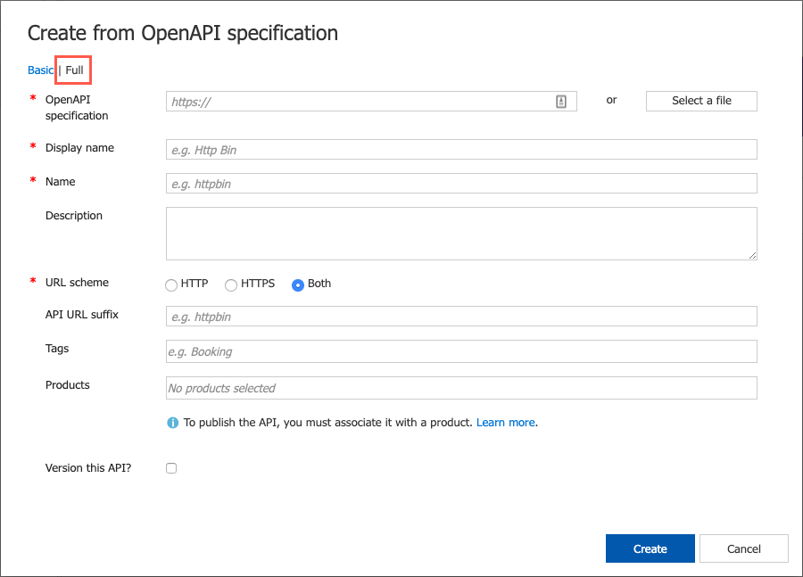
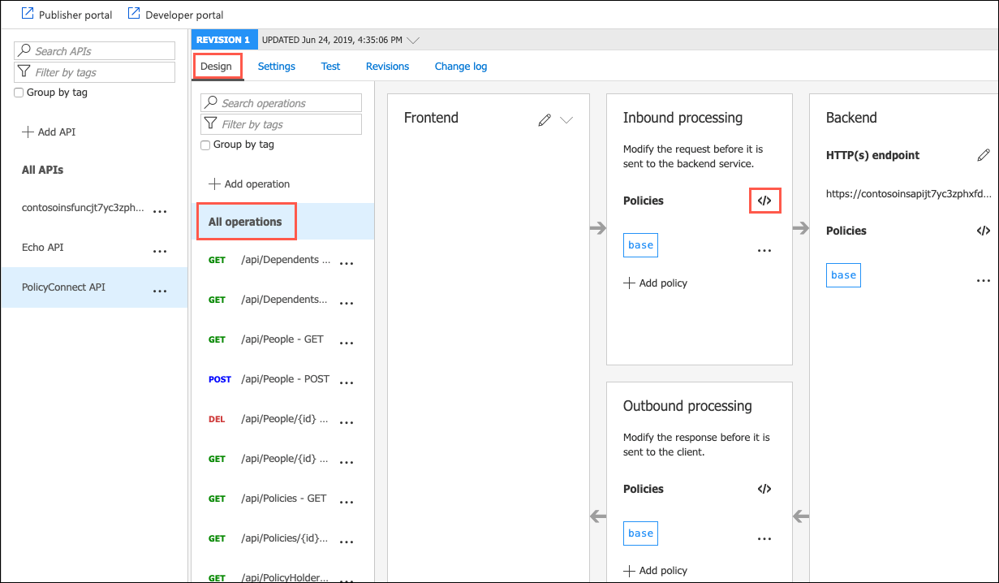
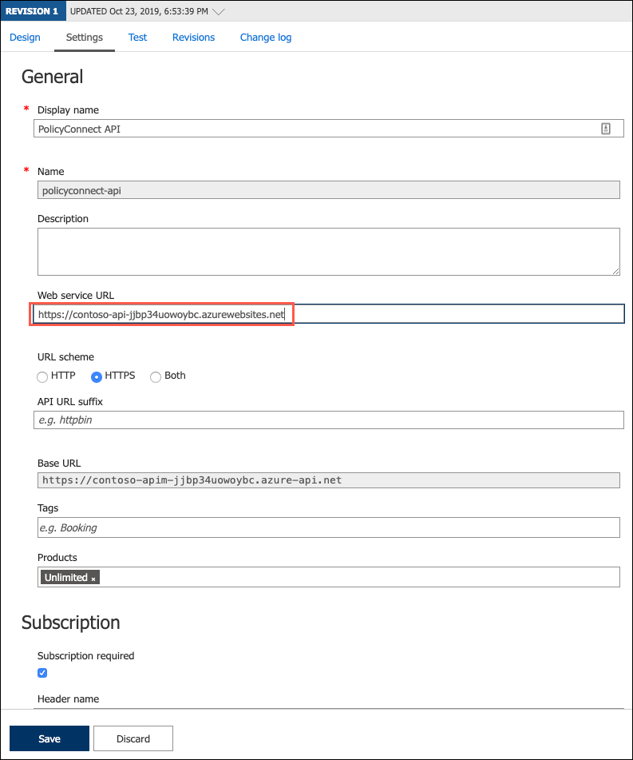
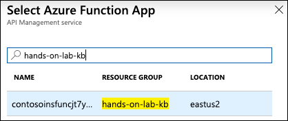
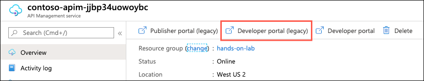
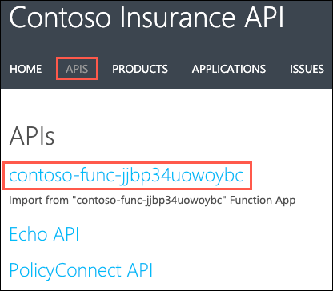

# App modernization hands-on lab step-by-step

## Abstract and learning objectives

In this hands-on lab, you implement the steps to modernize a legacy on-premises application, including upgrading and migrating the database to Azure and updating the application to take advantage of serverless and cloud services.

At the end of this hands-on lab, your ability to build solutions for modernizing legacy on-premises applications and infrastructure using cloud services will be improved.

## Overview

Contoso, Ltd. (Contoso) is a new company in an old business. Founded in Auckland, NZ, in 2011, they provide a full range of long-term insurance services to help individuals who are under-insured, filling a void their founders saw in the market. From the beginning, they grew faster than anticipated and have struggled to cope with rapid growth. During their first year alone, they added over 100 new employees to keep up with the demand for their services. To manage policies and associated documentation, they use a custom-developed Windows Forms application, called PolicyConnect. PolicyConnect uses an on-premises SQL Server 2008 R2 database as its data store, along with a file server on its local area network for storing policy documents. That application and its underlying processes for managing policies have become increasingly overloaded.

Contoso recently started a new web and mobile projects to allow policyholders, brokers, and employees to access policy information without requiring a VPN connection into the Contoso network. The web project is a new .NET Core 2.2 MVC web application, which accesses the PolicyConnect database using REST APIs. They eventually intend to share the REST APIs across all their applications, including the mobile app and WinForms version of PolicyConnect. They have a prototype of the web application running on-premises and are interested in taking their modernization efforts a step further by hosting the app in the cloud. However, they don't know how to take advantage of all the managed services of the cloud since they have no experience with it. They would like some direction converting what they have created so far into a more cloud-native application.

They have not started the development of a mobile app yet. Contoso is looking for guidance on how to take a .NET developer-friendly approach to implement the PolicyConnect mobile app on Android and iOS.

To prepare for hosting their applications in the cloud, they would like to migrate their SQL Server database to a PaaS SQL service in Azure. Contoso is hoping to take advantage of the advanced security features available in a fully-managed SQL service in the Azure. By migrating to the cloud, they hope to improve their technological capabilities and take advantage of enhancements and services that are enabled by moving to the cloud. The new features they would like to add are automated document forwarding from brokers, secure access for brokers, access to policy information, and reliable policy retrieval for a dispersed workforce. They have been clear that they will continue using the PolicyConnect WinForms application on-premises, but want to update the application to use cloud-based APIs and services. Additionally, they want to store policy documents in cloud storage for retrieval via the web and mobile apps.

## Solution architecture

Below is a high-level architecture diagram of the solution you implement in this hands-on lab. Please review this carefully, so you understand the whole of the solution as you are working on the various components.


The solution begins with migrating Contoso's SQL Server 2008 R2 database to Azure SQL Database using the Azure Database Migration Service (DMS). Using the Data Migration Assistant (DMA) assessment, Contoso determined that they can migrate into a fully-managed SQL database service in Azure. The assessment revealed no compatibility issues or unsupported features that would prevent them from using Azure SQL Database. Next, they deploy the web and API apps into Azure App Services. Also, mobile apps, built for Android and iOS using Xamarin, are created to provide remote access to PolicyConnect. The website, hosted in a Web App, provides the user interface for browser-based clients, whereas the Xamarin Forms-based app provides the UI for mobile devices. Both the mobile app and website rely on web services hosted in a Function App, which sits behind API Management. An API App is also deployed to host APIs for the legacy Windows Forms desktop application. Light-weight, serverless APIs are provided by Azure Functions and Azure Functions Proxies to provide access to the database and policy documents stored in Blob Storage.

Azure API Management is used to create an API Store for development teams and affiliated partners. Sensitive configuration data, like connection strings, are stored in Key Vault and accessed from the APIs or Web App on demand so that these settings never live in their file system. The API App implements the cache aside pattern using Azure Redis Cache. A full-text cognitive search pipeline is used to index policy documents in Blob Storage. Cognitive Services are used to enable search index enrichment using cognitive skills in Azure Search. PowerApps is used to enable authorized business users to build mobile and web create, read, update, delete (CRUD) applications. These apps interact with SQL Database and Azure Storage. Microsoft Flow enables them to orchestrations between services such as Office 365 email and services for sending mobile notifications. These orchestrations can be used independently of PowerApps or invoked by PowerApps to provide additional logic. The solution uses user and application identities maintained in Azure AD.

> **Note:** The solution provided is only one of many possible, viable approaches.

## Requirements

- Microsoft Azure subscription must be pay-as-you-go or MSDN.
  - Trial subscriptions will not work.
- A virtual machine configured with Visual Studio Community 2019 or higher (setup in the Before the hands-on lab exercises)
- **IMPORTANT**: To complete this lab, you must have sufficient rights within your Azure AD tenant to:
  - Create an Azure Active Directory application and service principal
  - Assign roles on your subscription
  - Register resource providers

## Exercise 9: Import and publish APIs into APIM

Duration: 30 minutes

In this exercise, you publish your API App and Function App API endpoints through API Management.

### Task 1: Import API App

In this task, you import your API App into APIM, using the OpenAPI specification, which leverages the Swagger definition associated with your API app.

1. In the Azure portal, navigate to your **API Management Service** by selecting it from the list of resources under your hands-on-lab-SUFFIX resource group.

    

2. On the API Management service select the **APIs** blade, and then select **+ Add API** and select **OpenAPI**.

    

3. A dialog to Create from OpenAPI specification is displayed. Select **Full** to expand the options that need to be entered.

    

4. Retrieve the value for the OpenAPI specification field from the `swagger` page of your API APP. (This is the URL of your API app, which you can retrieve from its overview blade in the Azure portal) plus "/swagger". (e.g., <https://contoso-api-jt7yc3zphxfda.azurewebsites.net/swagger>).

5. On the Swagger page for your API App, right-click on the `swagger/v1/swagger.json` file link just below the PolicyConnect API title, and select **Copy link address**.

    

6. Return to the API Management Create from OpenAPI specification dialog, and enter the following:

    - **OpenAPI specification**: Paste the copied link address from your Swagger page.
    - **Display name**: This is automatically populated from the Swagger definition.
    - **Name**: This is automatically populated from the Swagger definition.
    - **URL scheme**: Choose **HTTPS**.
    - **Products**: Select the **Unlimited** tag by clicking the field and selecting it from the dropdown list.

    

7. After creating the API, select the **PolicyConnect API** from the list of APIs on the left, and on the Design tab, with All operations selected, select the **Policies** icon in the Inbound process tile.

    

8. On the Policies screen, insert the code below between the `<inbound></inbound>` tags, and below the `<base />` tag. You need to **replace** `<your-web-app-url>` between the `<origin></origin>` tags with the URL for your Web App.

    ```xml
    <cors allow-credentials="true">
        <allowed-origins>
            <origin><your-web-app-url></origin>
        </allowed-origins>
        <allowed-methods>
            <method>*</method>
        </allowed-methods>
        <allowed-headers>
            <header>*</header>
        </allowed-headers>
        <expose-headers>
            <header>*</header>
        </expose-headers>
    </cors>
    ```

    Your updated policies value should look similar to the following:

    

    > **Note**: The policy added above is for handling cross-origin resource sharing (CORS). If you are testing the web app locally, you need to add another `<origin></origin>` tag within `<allowed-origins></allowed-origins>` that contains `https://localhost:<port-number>`, where `<port-number>` is the port assigned by your debugger (as is shown in the screenshot above).

9. Select **Save**.

10. Next, select the **Settings** tab. On the Settings tab, enter the URL of your API App, starting with `https://`. **Note**: You can copy this value from the text editor you have been using to store values throughout this lab.

    

11. Select **Save** on the Settings tab.

### Task 2: Import Function App

In this task, you import your Function App into APIM.

1. Select **+ Add API** again, and this time select **Function App** as the source of the API.

    

2. On the Create from Function App dialog, select the **Browse** button next to the Function App field.

3. In the Import Azure Functions blade, select **Function App** and then select your Function App from the list, and choose **Select**.

    

    >**Note**: You can filter using your resource group name, if needed.

4. Back on the Import Azure Functions blade, ensure the PolicyDocs function is checked, and choose **Select**.

    

5. Back on the Create from Function App dialog in APIM, all of the properties for the API are set from your Azure Function. Set the Products to Unlimited, as you did previously. Note, you may need to select **Full** at the top to see the Products box.

    

6. Select **Create**.

### Task 3: Open Developer Portal and retrieve you API key

In this task, you quickly look at the APIs in the Developer Portal, and retrieve your key. The Developer Portal allows you to check the list of APIs and endpoints as well as find useful information about them.

1. Open the APIM Developer Portal by selecting **Developer portal (legacy)** from the Overview blade of your API Management service in the Azure portal.

    

2. In the Azure API Management portal, select **APIs** from the top menu, and then select the API associated with your Function App.

    

3. The API page allows you to view and test your API endpoints directly in the Developer portal.

    

4. Copy the highlighted request URL. This is the new value you use for the `PolicyDocumentsPath` setting in the next task.

    > **Note**: We don't need to do this for the PolicyConnect API because the path is defined by the Swagger definition. The only thing that needs to change for that is the base URL, which points to APIM and not your API App.

5. Next, select the **Administrator** drop down located near the top right of the API page, and then select **Profile** from the fly-out menu. The **Profile** page allows you to retrieve your `Ocp-Apim-Subscription-Key` value, which you need to retrieve so the PolicyConnect web application can access the APIs through APIM.

6. On the Profile page, select **Show** next to the Primary Key for the **Unlimited** Product, copy the key value and paste it into a text editor for use below.

    

### Task 4: Update Web App to use API Management Endpoints

In this task, you use the Azure Cloud Shell and Azure CLI to update the `ApiUrl` and `PolicyDocumentsPath` settings for the PolicyConnect Web App. You also add a new setting for the APIM access key.

1. In the [Azure portal](https://portal.azure.com), select the Azure Cloud Shell icon from the menu at the top right of the screen.

    

2. In the Cloud Shell window that opens at the bottom of your browser window, select **PowerShell**.

    

3. After a moment, you receive a message that you have successfully requested a Cloud Shell, and be presented with a PS Azure prompt.

    

4. At the Cloud Shell prompt, run the following command to retrieve your Web App name, making sure to replace `<your-resource-group-name>` with your resource group name:

    ```powershell
    $resourceGroup = "<your-resource-group-name>"
    az webapp list -g $resourceGroup --output table
    ```

5. In the output, copy the name of Web App (the resource name starts with contoso-**web**) into a text editor for use below.

    

6. Next replace the tokenized values in the following command as specified below, and then run it from the Azure Cloud Shell command prompt.

    - `<your-web-app-name>`: Replace with your Web App name, which you copied in above.
    - `<your-apim-gateway-url>`: Replace with the Gateway URL of your API Management instance, which you can find on the Overview blade of the API Management Service in the Azure portal.
    - `<your-apim-subscription-key>`: Replace with the APIM `Ocp-Apim-Subscription-Key` value that you copied into a text editor above.
    - `<your-apim-function-app-path>`: Replace with path you copied for your Function App within API Management, that is to be used for the `PolicyDocumentsPath` setting.

    ```powershell
    $webAppName = "<your-web-app-name>"
    $apimUrl = "<your-apim-gateway-url>"
    $apimKey = "<your-apim-subscription-key>"
    $policyDocsPath = "<your-apim-function-app-path>"
    az webapp config appsettings set -n $webAppName -g $resourceGroup --settings "PolicyDocumentsPath=$policyDocsPath" "ApiUrl=$apimUrl" "ApimSubscriptionKey=$apimKey"
    ```

7. In the output, note the newly added and updated settings in your Web App's application settings. The settings were updated by the script above and triggered a restart of your web app.

8. In a web browser, navigate to the Web app URL, and verify you still see data when you select one of the tabs.