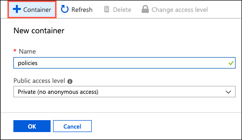
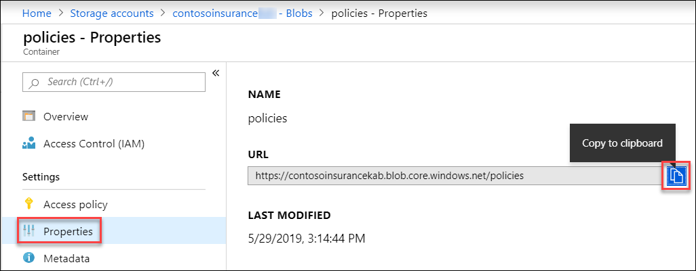
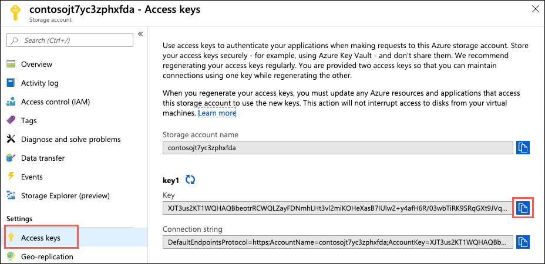
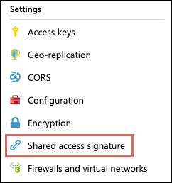
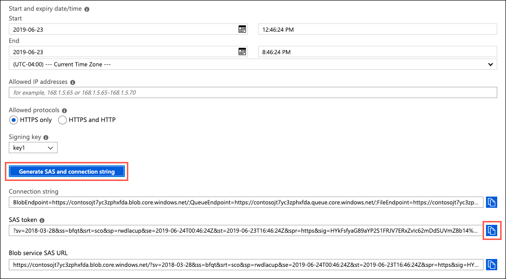
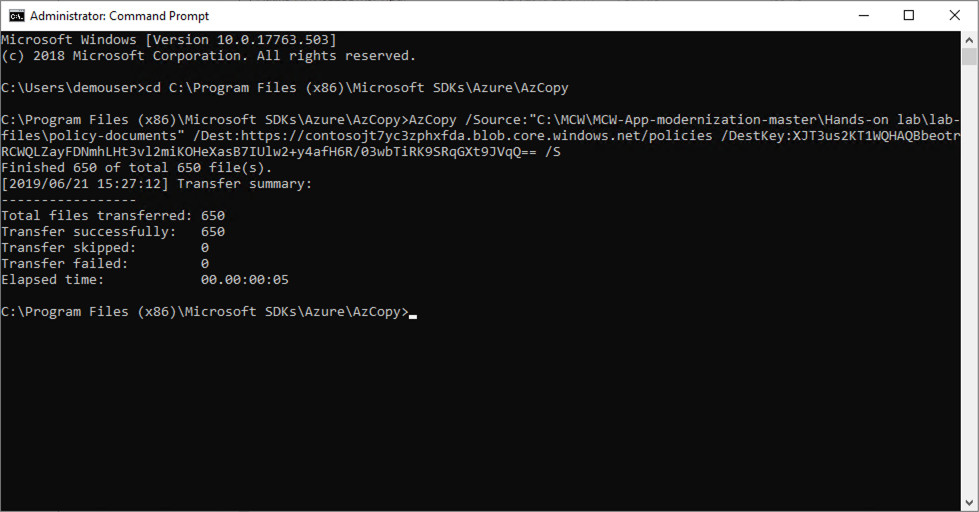
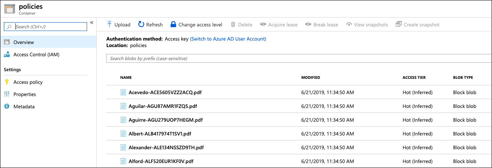

# App modernization hands-on lab step-by-step

## Abstract and learning objectives

In this hands-on lab, you implement the steps to modernize a legacy on-premises application, including upgrading and migrating the database to Azure and updating the application to take advantage of serverless and cloud services.

At the end of this hands-on lab, your ability to build solutions for modernizing legacy on-premises applications and infrastructure using cloud services will be improved.

## Overview

Contoso, Ltd. (Contoso) is a new company in an old business. Founded in Auckland, NZ, in 2011, they provide a full range of long-term insurance services to help individuals who are under-insured, filling a void their founders saw in the market. From the beginning, they grew faster than anticipated and have struggled to cope with rapid growth. During their first year alone, they added over 100 new employees to keep up with the demand for their services. To manage policies and associated documentation, they use a custom-developed Windows Forms application, called PolicyConnect. PolicyConnect uses an on-premises SQL Server 2008 R2 database as its data store, along with a file server on its local area network for storing policy documents. That application and its underlying processes for managing policies have become increasingly overloaded.

Contoso recently started a new web and mobile projects to allow policyholders, brokers, and employees to access policy information without requiring a VPN connection into the Contoso network. The web project is a new .NET Core 2.2 MVC web application, which accesses the PolicyConnect database using REST APIs. They eventually intend to share the REST APIs across all their applications, including the mobile app and WinForms version of PolicyConnect. They have a prototype of the web application running on-premises and are interested in taking their modernization efforts a step further by hosting the app in the cloud. However, they don't know how to take advantage of all the managed services of the cloud since they have no experience with it. They would like some direction converting what they have created so far into a more cloud-native application.

They have not started the development of a mobile app yet. Contoso is looking for guidance on how to take a .NET developer-friendly approach to implement the PolicyConnect mobile app on Android and iOS.

To prepare for hosting their applications in the cloud, they would like to migrate their SQL Server database to a PaaS SQL service in Azure. Contoso is hoping to take advantage of the advanced security features available in a fully-managed SQL service in the Azure. By migrating to the cloud, they hope to improve their technological capabilities and take advantage of enhancements and services that are enabled by moving to the cloud. The new features they would like to add are automated document forwarding from brokers, secure access for brokers, access to policy information, and reliable policy retrieval for a dispersed workforce. They have been clear that they will continue using the PolicyConnect WinForms application on-premises, but want to update the application to use cloud-based APIs and services. Additionally, they want to store policy documents in cloud storage for retrieval via the web and mobile apps.

## Solution architecture

Below is a high-level architecture diagram of the solution you implement in this hands-on lab. Please review this carefully, so you understand the whole of the solution as you are working on the various components.


The solution begins with migrating Contoso's SQL Server 2008 R2 database to Azure SQL Database using the Azure Database Migration Service (DMS). Using the Data Migration Assistant (DMA) assessment, Contoso determined that they can migrate into a fully-managed SQL database service in Azure. The assessment revealed no compatibility issues or unsupported features that would prevent them from using Azure SQL Database. Next, they deploy the web and API apps into Azure App Services. Also, mobile apps, built for Android and iOS using Xamarin, are created to provide remote access to PolicyConnect. The website, hosted in a Web App, provides the user interface for browser-based clients, whereas the Xamarin Forms-based app provides the UI for mobile devices. Both the mobile app and website rely on web services hosted in a Function App, which sits behind API Management. An API App is also deployed to host APIs for the legacy Windows Forms desktop application. Light-weight, serverless APIs are provided by Azure Functions and Azure Functions Proxies to provide access to the database and policy documents stored in Blob Storage.

Azure API Management is used to create an API Store for development teams and affiliated partners. Sensitive configuration data, like connection strings, are stored in Key Vault and accessed from the APIs or Web App on demand so that these settings never live in their file system. The API App implements the cache aside pattern using Azure Redis Cache. A full-text cognitive search pipeline is used to index policy documents in Blob Storage. Cognitive Services are used to enable search index enrichment using cognitive skills in Azure Search. PowerApps is used to enable authorized business users to build mobile and web create, read, update, delete (CRUD) applications. These apps interact with SQL Database and Azure Storage. Microsoft Flow enables them to orchestrations between services such as Office 365 email and services for sending mobile notifications. These orchestrations can be used independently of PowerApps or invoked by PowerApps to provide additional logic. The solution uses user and application identities maintained in Azure AD.

> **Note:** The solution provided is only one of many possible, viable approaches.

## Requirements

- Microsoft Azure subscription must be pay-as-you-go or MSDN.
  - Trial subscriptions will not work.
- A virtual machine configured with Visual Studio Community 2019 or higher (setup in the Before the hands-on lab exercises)
- **IMPORTANT**: To complete this lab, you must have sufficient rights within your Azure AD tenant to:
  - Create an Azure Active Directory application and service principal
  - Assign roles on your subscription
  - Register resource providers

## Exercise 6: Upload policy documents into blob storage

Duration: 10 minutes.

Contoso is currently storing all of their scanned PDF documents on a shared local network. They have asked to be able to store them in the cloud automatically from a workflow. In this exercise, you provide a storage account to store the files in a blob container. Then, you provide a way to bulk upload their existing PDFs.

### Task 1: Create container for storing PDFs in Azure storage

In this task, you create a new blob container in your storage account for the scanned PDF policy documents.

1. In the [Azure portal](https://portal.azure.com), navigate to your **Storage account** resource by selecting **Resource groups** from Azure services list, selecting the **hands-on-lab-SUFFIX** resource group, and then selecting the **contosoUniqueId** Storage account resource from the list of resources.

    

2. From the Storage account Overview blade, select **Containers** under services.

    

3. On the Container blade, select **+ Container** to create a new container, and in the New container dialog, enter "policies" as the container name. Leave the Public access level set to **Private (no anonymous access)**, and then select **OK**.

    

4. After the container has been created, select it on the Container blade, then select **Properties** from the left-hand menu, and copy the URL from the policies - Properties blade. Paste the copied URL into a text editor for later reference.

    

5. Next retrieve the access key for your storage account, which you need to provide to AzCopy below to connect to your storage container. On your Storage account blade in the Azure portal, select **Access keys** from the left-hand menu, and copy the **key1 Key** value to a text editor for use below.

    

### Task 2: Create a SAS token

In this task, you generate a shared access signature (SAS) token for your storage account. This is used later in the lab to allow your Azure Function to retrieve files from the `policies` storage account container.

1. On your Storage account blade in the Azure portal, and select **Shared access signature** from the left-hand menu.

    

2. On the Shared access signature blade, select **Generate SAS and connection string**, and then copy the SAS token value by selecting the Copy to clipboard button to the right of the value.

    

3. Paste the SAS token into a text editor for later use.

### Task 3: Bulk upload PDFs to blob storage using AzCopy

In this task, you download and install [AzCopy](https://docs.microsoft.com/en-us/azure/storage/common/storage-use-azcopy). You then use AzCopy to copy the PDF files from the "on-premises" location into the policies container in Azure storage.

1. On your LabVM, open a web browser and download the latest version of AzCopy from <https://aka.ms/downloadazcopy>.

2. Run the downloaded installer, accepting the license agreement and all the defaults, to complete the AzCopy install.

3. Launch a Command Prompt window (Select search on the task bar, type **cmd**, and select Enter) on your LabVM.

4. At the Command prompt, change the directory to the AzCopy directory. By default, it is installed to `C:\Program Files (x86)\Microsoft SDKs\Azure\AzCopy` (On a 32-bit machine, change `Program Files (x86)` to `Program Files` ). You can do this by running the command:

   ```bash
   cd C:\Program Files (x86)\Microsoft SDKs\Azure\AzCopy
   ```

5. Enter the following command at the command prompt. The tokenized values should be replaced as follows:

   - `[FILE-SOURCE]`: This is the path to the `policy-documents` folder your downloaded copy of the GitHub repo. If you used the extraction path of `C:\MCW`, the path is `C:\MCW\MCW-App-modernization-master\Hands-on lab\lab-files\policy-documents`.
   - `[STORAGE-CONTAINER-URL]`: This is the URL to your storage account's policies container, which you copied in the last step of the previous task. (e.g., <https://contosojt7yc3zphxfda.blob.core.windows.net/policies>)
   - `[STORAGE-ACCOUNT-KEY]`: This is the blob storage account key you copied previously in this task. (e.g., `eqgxGSnCiConfgshXQ1rFwBO+TtCH6sduekk6s8PxPBxHWOmFumycTeOlL3myb8eg4Ba2dn7rtdHnk/1pi6P/w==`)

   ```bash
   AzCopy /Source:"[FILE-SOURCE]" /Dest:"[STORAGE-CONTAINER-URL]" /DestKey:"[STORAGE-ACCOUNT-KEY]" /S
   ```

6. The final command should resemble the following:

    ```bash
    AzCopy /Source:"C:\MCW\MCW-App-modernization-master\Hands-on lab\lab-files\policy-documents" /Dest:"https://contosojt7yc3zphxfda.blob.core.windows.net/policies" /DestKey:"XJT3us2KT1WQHAQBbeotrRCWQLZayFDNmhLHt3vl2miKOHeXasB7IUlw2+y4afH6R/03wbTiRK9SRqGXt9JVqQ==" /S
    ```

7. In the output of the command, you should see that 650 files were transferred successfully.

    

8. You can verify the upload by navigating to the policies container in your Azure Storage account.

    