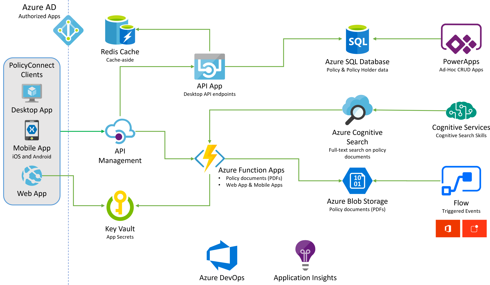
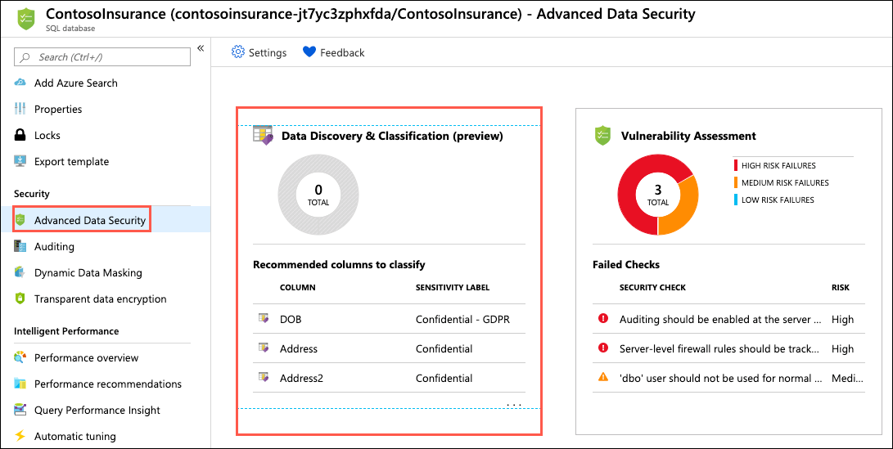
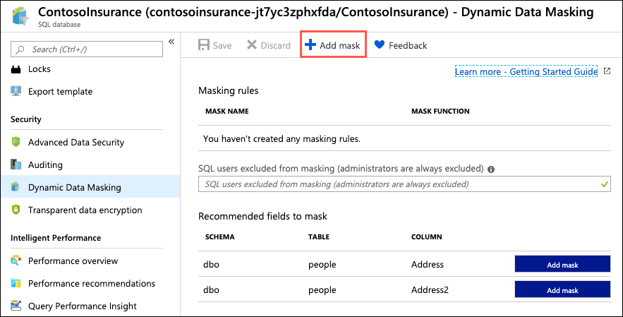
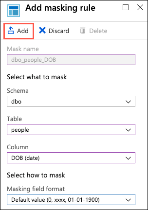
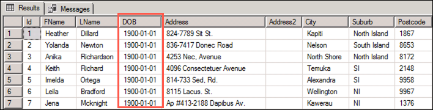

# App modernization hands-on lab step-by-step

## Abstract and learning objectives

In this hands-on lab, you implement the steps to modernize a legacy on-premises application, including upgrading and migrating the database to Azure and updating the application to take advantage of serverless and cloud services.

At the end of this hands-on lab, your ability to build solutions for modernizing legacy on-premises applications and infrastructure using cloud services will be improved.

## Overview

Contoso, Ltd. (Contoso) is a new company in an old business. Founded in Auckland, NZ, in 2011, they provide a full range of long-term insurance services to help individuals who are under-insured, filling a void their founders saw in the market. From the beginning, they grew faster than anticipated and have struggled to cope with rapid growth. During their first year alone, they added over 100 new employees to keep up with the demand for their services. To manage policies and associated documentation, they use a custom-developed Windows Forms application, called PolicyConnect. PolicyConnect uses an on-premises SQL Server 2008 R2 database as its data store, along with a file server on its local area network for storing policy documents. That application and its underlying processes for managing policies have become increasingly overloaded.

Contoso recently started a new web and mobile projects to allow policyholders, brokers, and employees to access policy information without requiring a VPN connection into the Contoso network. The web project is a new .NET Core 2.2 MVC web application, which accesses the PolicyConnect database using REST APIs. They eventually intend to share the REST APIs across all their applications, including the mobile app and WinForms version of PolicyConnect. They have a prototype of the web application running on-premises and are interested in taking their modernization efforts a step further by hosting the app in the cloud. However, they don't know how to take advantage of all the managed services of the cloud since they have no experience with it. They would like some direction converting what they have created so far into a more cloud-native application.

They have not started the development of a mobile app yet. Contoso is looking for guidance on how to take a .NET developer-friendly approach to implement the PolicyConnect mobile app on Android and iOS.

To prepare for hosting their applications in the cloud, they would like to migrate their SQL Server database to a PaaS SQL service in Azure. Contoso is hoping to take advantage of the advanced security features available in a fully-managed SQL service in the Azure. By migrating to the cloud, they hope to improve their technological capabilities and take advantage of enhancements and services that are enabled by moving to the cloud. The new features they would like to add are automated document forwarding from brokers, secure access for brokers, access to policy information, and reliable policy retrieval for a dispersed workforce. They have been clear that they will continue using the PolicyConnect WinForms application on-premises, but want to update the application to use cloud-based APIs and services. Additionally, they want to store policy documents in cloud storage for retrieval via the web and mobile apps.

## Solution architecture

Below is a high-level architecture diagram of the solution you implement in this hands-on lab. Please review this carefully, so you understand the whole of the solution as you are working on the various components.



The solution begins with migrating Contoso's SQL Server 2008 R2 database to Azure SQL Database using the Azure Database Migration Service (DMS). Using the Data Migration Assistant (DMA) assessment, Contoso determined that they can migrate into a fully-managed SQL database service in Azure. The assessment revealed no compatibility issues or unsupported features that would prevent them from using Azure SQL Database. Next, they deploy the web and API apps into Azure App Services. Also, mobile apps, built for Android and iOS using Xamarin, are created to provide remote access to PolicyConnect. The website, hosted in a Web App, provides the user interface for browser-based clients, whereas the Xamarin Forms-based app provides the UI for mobile devices. Both the mobile app and website rely on web services hosted in a Function App, which sits behind API Management. An API App is also deployed to host APIs for the legacy Windows Forms desktop application. Light-weight, serverless APIs are provided by Azure Functions and Azure Functions Proxies to provide access to the database and policy documents stored in Blob Storage.

Azure API Management is used to create an API Store for development teams and affiliated partners. Sensitive configuration data, like connection strings, are stored in Key Vault and accessed from the APIs or Web App on demand so that these settings never live in their file system. The API App implements the cache aside pattern using Azure Redis Cache. A full-text cognitive search pipeline is used to index policy documents in Blob Storage. Cognitive Services are used to enable search index enrichment using cognitive skills in Azure Search. PowerApps is used to enable authorized business users to build mobile and web create, read, update, delete (CRUD) applications. These apps interact with SQL Database and Azure Storage. Microsoft Flow enables them to orchestrations between services such as Office 365 email and services for sending mobile notifications. These orchestrations can be used independently of PowerApps or invoked by PowerApps to provide additional logic. The solution uses user and application identities maintained in Azure AD.

> **Note:** The solution provided is only one of many possible, viable approaches.

## Requirements

- Microsoft Azure subscription must be pay-as-you-go or MSDN.
  - Trial subscriptions will not work.
- A virtual machine configured with Visual Studio Community 2019 or higher (setup in the Before the hands-on lab exercises)
- **IMPORTANT**: To complete this lab, you must have sufficient rights within your Azure AD tenant to:
  - Create an Azure Active Directory application and service principal
  - Assign roles on your subscription
  - Register resource providers

## Exercise 2: Post upgrade database enhancements

Duration: 30 minutes

In this exercise you explore some of the security features of Azure SQL Database, and review some of the security benefits that come with running your database in Azure. [SQL Database Advance Data Security](https://docs.microsoft.com/azure/sql-database/sql-database-advanced-data-security) (ADS) provides advanced SQL security capabilities, including functionality for discovering and classifying sensitive data, surfacing and mitigating potential database vulnerabilities, and detecting anomalous activities that could indicate a threat to your database.

> **Note**: Advanced Data Security was enabled on the database with the ARM template, so you do not need to do that here.

### Task 1: Configure SQL Data Discovery and Classification

In this task, you look at the [SQL Data Discovery and Classification](https://docs.microsoft.com/sql/relational-databases/security/sql-data-discovery-and-classification?view=sql-server-2017) feature of Advanced Data Security. Data Discovery & Classification introduces a new tool for discovering, classifying, labeling & reporting the sensitive data in your databases. It introduces a set of advanced services, forming a new SQL Information Protection paradigm aimed at protecting the data in your database, not just the database. Discovering and classifying your most sensitive data (business, financial, healthcare, etc.) can play a pivotal role in your organizational information protection stature.

1. In the [Azure portal](https://portal.azure.com), navigate to your **SQL database** resource by selecting **Resource groups** from Azure services list, selecting the **hands-on-lab-SUFFIX** resource group, and then selecting the **ContosoInsurance** SQL database resource from the list of resources.

   

2. On the SQL database blade, select **Advance Data Security** from the left-hand menu, and then select the **Data Discovery & Classification** tile.

    

3. On the **Data Discovery & Classification** blade, select the info link with the message **We have found 7 columns with classification recommendations**.

    

4. The classification engine scans the database and provides a list of recommended column classifications. Look over the list of recommendations to get a better understanding of the types of data and classifications are assigned, based on the built-in classification settings. In the list of classification recommendations, note the recommended classification for the **dbo - people - DOB** field (Confidential - GDPR).

    

5. Contoso is very concerned about the potential cost of any GDPR violations, and would like to label any GDPR fields as _Highly Confidential - GDPR_. To update this, select **+ Add classification** in the Data Discovery & Classification toolbar.

   

6. In the Add classification dialog, quickly expand the **Sensitivity label** field, and review the various built-in labels you can choose from. You can also add your own labels, should you desire.

    

7. In the Add classification dialog, enter the following:

    - **Schema name**: Select dbo.
    - **Table name**: Select people.
    - **Column name**: Select DOB (date).
    - **Information type**: Select Date Of Birth.
    - **Sensitivity level**: Select Highly Confidential - GDPR.

    

8. Select **Add classification**.

9. After adding the new classification, the **dbo - people - DOB** field disappears from the recommendations list, and the number of recommendations drop by 1.

10. Select **Save** on the toolbar to save the changes.

    

11. To accept the remaining recommendations, you can check the **Select all** option and then select **Accept selected recommendations**.

    

12. Select **Save** on the toolbar to save the changes.

    

13. When the save completes, select the **Overview** tab on the Data Discovery & Classification blade to view a report with a full summary of the database classification state.

    

### Task 2: Review Advanced Data Security Vulnerability Assessment

In this task, you review an assessment report generated by ADS for the `ContosoInsurance` database. The [SQL Vulnerability Assessment service](https://docs.microsoft.com/azure/sql-database/sql-vulnerability-assessment) is a service that provides visibility into your security state, and includes actionable steps to resolve security issues, and enhance your database security.

1. Return to the **Advanced Data Security** blade for the `ContosoInsurance` SQL database and then select the **Vulnerability Assessment** tile.

2. Navigate to **Advance Data Security** on the **Security** section of your Azure SQL Database.

3. Select **Vulnerability Assessment**.

    

4. On the Vulnerability Assessment blade, select **Scan** on the toolbar.

    

5. When the scan completes, select the **Overview** tab and observe the dashboard, which displays the number of failing checks, passing checks, and a breakdown of the risk summary by severity level.

    

6. In the scan results, take a few minutes to browse both the Failed and Passed checks, and review the types of checks that are performed. In the **Failed** the list, select any of the failed checks to view the detailed description.

    

    > The details for each finding provide more insight into the reason for the finding. Of note are the fields describing the finding, the impact of the recommended settings, and details on how to remediate the finding.

### Task 3: Enable Dynamic Data Masking

In this task, you enable [Dynamic Data Masking](https://docs.microsoft.com/sql/relational-databases/security/dynamic-data-masking?view=sql-server-ver15) (DDM) into your Azure SQL Database to limit access to sensitive data in the database through query results. This feature helps prevent unauthorized access to sensitive data by enabling customers to designate how much of the sensitive data to reveal with minimal impact on the application layer. It’s a policy-based security feature that hides the sensitive data in the result set of a query over designated database fields, while the data in the database is not changed.

> For example, a service representative at a call center may identify callers by several digits of their credit card number, but those data items should not be fully exposed to the service representative. A masking rule can be defined that masks all but the last four digits of any credit card number in the result set of any query. As another example, an appropriate data mask can be defined to protect personally identifiable information (PII) data, so that a developer can query production environments for troubleshooting purposes without violating compliance regulations.

1. Return to the Overview blade of your SQL database in the [Azure portal](https://portal.azure.com), and select **Dynamic Data Masking** from the left-hand menu.

    

2. On the Dynamic Data Masking blade, you may see a few recommended fields to mask that have been flagged as they may contain sensitive data. For our case, we want to apply a mask to the `DOB` field on the `people` table to provide more protection to GDPR data. To do this, select **+ Add mask** in the Dynamic Data Masking toolbar.

    

3. On the Add masking rule blade, enter the following:

   - **Schema**: Select dbo.
   - **Table**: Select people.
   - **Column**: Select DOB (date).
   - **Masking field format**: Select Default value (0, xxx, 01-01-1900).
   - Select **Add**.

   

4. Select **Save**.

   

5. To view the impact of the Dynamic Data Masking, return to SSMS on your SqlServer2008 VM and run a few queries against the `people` table. On your SqlServer2008 VM, open SSMS and connect to the Azure SQL Database, by selecting **Connect->Database Engine** in the Object Explorer, and then entering the following into the Connect to server dialog:

    - **Server name**: Paste the server name of your Azure SQL Database, as you've done previously.
    - **Authentication type**: Select SQL Server Authentication.
    - **Username**: Enter **demouser**
    - **Password**: Enter **Password.1!!**
    - **Remember password**: Check this box.

    

6. Select **Connect**.

7. Once connected, expand Databases, right-click the `ContosoInsurance` database and select **New Query**.

   

8. To be able to test the mask applied to the `people.DOB` field, you need to create a user in the database that can be used for testing the masked field. This is because the `demouser` account you used to log in is a privileged user, so the mask is not be applied. In the new query window, paste the following SQL script into the new query window:

   ```sql
   USE [ContosoInsurance];
   GO

   CREATE USER DDMUser WITHOUT LOGIN;
   GRANT SELECT ON [dbo].[people] TO DDMUser;
   ```

   > The SQL script above creates a new user in the database named `DDMUser`, and grants that user `SELECT` rights on the `dbo.people` table.

9. Select **Execute** from the SSMS toolbar to run the query. A message that the commands completed successfully should appear in the Messages pane.

   

10. With the new user created, run a quick query to observe the results. Select **New Query** again, and paste the following into the new query window.

    ```sql
    USE [ContosoInsurance];
    GO

    EXECUTE AS USER = 'DDMUser';
    SELECT * FROM [dbo].[people];
    REVERT;
    ```

11. Select **Execute** from the toolbar, and examine the Results pane. Notice the `DOB` field is masked as `1900-01-01`, as defined by the mask format applied in the Azure portal.

    

12. For comparison, run the following query in a new query window to see how the data looks when running as a privileged user.

    ```sql
    SELECT TOP 100 * FROM [dbo].[people]
    ```

    

> **Note**: The SqlServer2008 VM is not needed for the remaining exercises of this hands-on lab. You can log off of that VM.